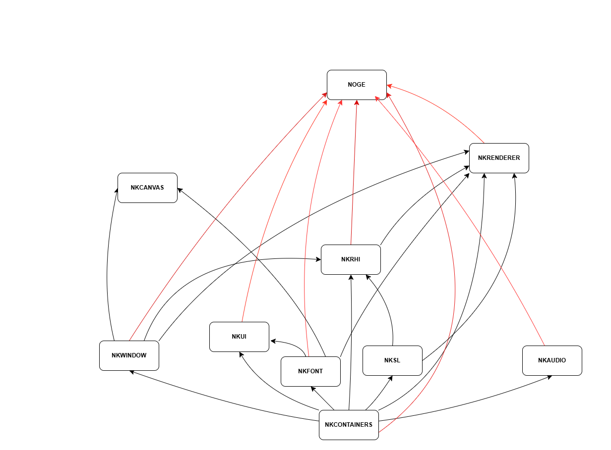

# PLAN D'UN MILLION DE LIGNES

## Décompte du nombre de ligne de chaque modules

> Le comptage des lignes de chaque modules des couches de nkentseu a été effectué avec l'outil **Cloc**. L'ensemble des commande utilisée ci dessous peuvent être facilement retrouvées et exécuté sur le dépôt de l'outil.

## **Couche Foundation** :

- **`NKPlatform`** :
commande  exécutée:
```
C:\Users\Administrator\Downloads\cloc\cloc-2.10.exe . --exclude-dir=Build --match-f="\.(cpp|h)$"
```

resultat:

```
32 text files.
      32 unique files.                              
       0 files ignored.

github.com/AlDanial/cloc v 2.10  T=0.28 s (115.9 files/s, 77401.7 lines/s)
-------------------------------------------------------------------------------
Language                     files          blank        comment           code
-------------------------------------------------------------------------------
C/C++ Header                    24           2409          13600           3501
C++                              8            246            665            955
-------------------------------------------------------------------------------
SUM:                            32           2655          14265           4456
-------------------------------------------------------------------------------
```

on observe ici que le nombre de lignes de code est de : **4456**

- **`NKCore`** : Commande exécutée:

```
C:\Users\Administrator\Downloads\cloc\cloc-2.10.exe . --exclude-dir=Build --match-f="\.(cpp|h)$"
```

résultat :

```
      32 text files.
      32 unique files.                              
       0 files ignored.

github.com/AlDanial/cloc v 2.10  T=0.28 s (115.9 files/s, 77401.7 lines/s)
-------------------------------------------------------------------------------
Language                     files          blank        comment           code
-------------------------------------------------------------------------------
C/C++ Header                    24           2409          13600           3501
C++                              8            246            665            955
-------------------------------------------------------------------------------
SUM:                            32           2655          14265           4456
-------------------------------------------------------------------------------
```

nombre de lignes de code au total : **4456**

- **`NKMemory`** :

Résultat :

```
      54 text files.
      54 unique files.                              
       0 files ignored.

github.com/AlDanial/cloc v 2.10  T=0.48 s (111.4 files/s, 45326.2 lines/s)
-------------------------------------------------------------------------------
Language                     files          blank        comment           code
-------------------------------------------------------------------------------
C++                             34           1545           2373           5823
C/C++ Header                    20           1655           7986           2596
-------------------------------------------------------------------------------
SUM:                            54           3200          10359           8419
-------------------------------------------------------------------------------
```

**Total de lignes** : **8419**

- **`NKContainers`** : Commande exécutée

**Resultat**
 :
```
     106 text files.
     106 unique files.                              
       0 files ignored.

github.com/AlDanial/cloc v 2.10  T=0.91 s (116.9 files/s, 70766.2 lines/s)
-------------------------------------------------------------------------------
Language                     files          blank        comment           code
-------------------------------------------------------------------------------
C/C++ Header                    54           4585          34083          12216
C++                             52           1620           5305           6382
-------------------------------------------------------------------------------
SUM:                           106           6205          39388          18598
-------------------------------------------------------------------------------
```
le nombre de ligne est donc de : **18598**

- **`NKMath`** :

```
      32 text files.
      32 unique files.                              
       0 files ignored.

github.com/AlDanial/cloc v 2.10  T=0.26 s (121.7 files/s, 71725.8 lines/s)
-------------------------------------------------------------------------------
Language                     files          blank        comment           code
-------------------------------------------------------------------------------
C/C++ Header                    17           1976           8254           4992
C++                             15            414           1455           1767
-------------------------------------------------------------------------------
SUM:                            32           2390           9709           6759
-------------------------------------------------------------------------------
```

nombre de lignes: **6759**

### Représentation réduite de la Couche Foundation

| Module | Lignes de code |
|---|---|
| NKContainers | **18 598** |
| NKMemory | 8 419 |
| NKMath | 6 759 |
| NKPlatform | 4 456 |
| NKCore | 4 456 |
| **Total** | **42 688** |

## **Couche System** :

- **`NKLogger`** :

Resultat:

```
      34 text files.
      34 unique files.                              
       0 files ignored.

github.com/AlDanial/cloc v 2.10  T=0.29 s (117.5 files/s, 59570.6 lines/s)
-------------------------------------------------------------------------------
Language                     files          blank        comment           code
-------------------------------------------------------------------------------
C++                             18            915           2202           2433
C/C++ Header                    16           1380           9492            819
-------------------------------------------------------------------------------
SUM:                            34           2295          11694           3252
-------------------------------------------------------------------------------
```
Nombre de lignes de code: **3252**

- **`NKFileSystem`** :

Resultat de la commande :

```
     15 text files.
      15 unique files.                              
       0 files ignored.

github.com/AlDanial/cloc v 2.10  T=0.16 s (91.9 files/s, 49412.2 lines/s)
-------------------------------------------------------------------------------
Language                     files          blank        comment           code
-------------------------------------------------------------------------------
C++                              8            637           1129           2185
C/C++ Header                     7            737           2886            489
-------------------------------------------------------------------------------
SUM:                            15           1374           4015           2674
-------------------------------------------------------------------------------
```

Total de lignes de code : **2674**

- **`NKStream`** :

```
      13 text files.
      13 unique files.                              
       0 files ignored.

github.com/AlDanial/cloc v 2.10  T=0.11 s (116.8 files/s, 6272.2 lines/s)
-------------------------------------------------------------------------------
Language                     files          blank        comment           code
-------------------------------------------------------------------------------
C/C++ Header                     7            105             77            427
C++                              6             21              0             68
-------------------------------------------------------------------------------
SUM:                            13            126             77            495
-------------------------------------------------------------------------------
```

Total de lignes: **495**

- **`NKThreading`** :

```
-------------------------------------------------------------------------------
Language                     files          blank        comment           code
-------------------------------------------------------------------------------
C++                             18            278           1039           1129
C/C++ Header                    19           1775           8881           1063
-------------------------------------------------------------------------------
SUM:                            37           2053           9920           2192
---------------------------
```

total de lignes de code: **2192**

- **`NKTime`** :

```
      21 text files.
      21 unique files.                              
       0 files ignored.

github.com/AlDanial/cloc v 2.10  T=0.18 s (119.9 files/s, 47036.4 lines/s)
-------------------------------------------------------------------------------
Language                     files          blank        comment           code
-------------------------------------------------------------------------------
C++                              9            444           1180           1050
C/C++ Header                    12           1048           3826            690
-------------------------------------------------------------------------------
SUM:                            21           1492           5006           1740
-------------------------------------------------------------------------------
```

total de lignes de code: **1740**

- **`NKNetwork`** :

```
      22 text files.
      22 unique files.                              
       0 files ignored.

github.com/AlDanial/cloc v 2.10  T=0.22 s (98.1 files/s, 85739.6 lines/s)
-------------------------------------------------------------------------------
Language                     files          blank        comment           code
-------------------------------------------------------------------------------
C++                             10           1370           1848           4963
C/C++ Header                    12           1591           8105           1346
-------------------------------------------------------------------------------
SUM:                            22           2961           9953           6309
-------------------------------------------------------------------------------
```
Total de lignes : **6309**

- **`NKReflection`** :

```
      24 text files.
      24 unique files.                              
       0 files ignored.

github.com/AlDanial/cloc v 2.10  T=0.23 s (102.9 files/s, 41323.9 lines/s)
-------------------------------------------------------------------------------
Language                     files          blank        comment           code
-------------------------------------------------------------------------------
C/C++ Header                    14            940           4214           1926
C++                             10            360           1598            596
-------------------------------------------------------------------------------
SUM:                            24           1300           5812           2522
-------------------------------------------------------------------------------
```
Total de lignes de code: **2522**

- **`NKSerialization`** :

```
      43 text files.
      43 unique files.                              
       0 files ignored.

github.com/AlDanial/cloc v 2.10  T=0.38 s (112.1 files/s, 55991.0 lines/s)
-------------------------------------------------------------------------------
Language                     files          blank        comment           code
-------------------------------------------------------------------------------
C++                             20            720           2506           3863
C/C++ Header                    23           1460           9967           2965
-------------------------------------------------------------------------------
SUM:                            43           2180          12473           6828
-------------------------------------------------------------------------------
```

Total de lignes de code: **6828**

### Représentation réduite de la Couche System

| Module | Lignes de code |
|---|---|
| NKSerialization | **6 828** |
| NKNetwork | 6 309 |
| NKLogger | 3 252 |
| NKFileSystem | 2 674 |
| NKReflection | 2 522 |
| NKThreading | 2 192 |
| NKTime | 1 740 |
| NKStream | 495 |
| **Total** | **26 012** |

## **Couche Runtime** :

- **`NKWindows`** :

**resultat du decompte** :

```
106 text files.
Unique:      100 files                                      106 unique files.                              
       0 files ignored.

github.com/AlDanial/cloc v 2.10  T=0.95 s (112.0 files/s, 29323.3 lines/s)
-------------------------------------------------------------------------------
Language                     files          blank        comment           code
-------------------------------------------------------------------------------
C++                             33           2335           1859          12354
C/C++ Header                    73           1611           3137           6446
-------------------------------------------------------------------------------
SUM:                           106           3946           4996          18800
-------------------------------------------------------------------------------
```

**Total de lignes de code** : **18800**

- **`NKEvent`** :

**resultat de decompte** :

```
      36 text files.
      36 unique files.                              
       0 files ignored.

github.com/AlDanial/cloc v 2.10  T=0.34 s (106.4 files/s, 86099.5 lines/s)
-------------------------------------------------------------------------------
Language                     files          blank        comment           code
-------------------------------------------------------------------------------
C/C++ Header                    25           2863          13443           6971
C++                             11            549           1717           3586
-------------------------------------------------------------------------------
SUM:                            36           3412          15160          10557
-------------------------------------------------------------------------------
```

**Total de lignes de code** : **10557**

- **`NKImage`** :

**Resultat du decompte** :

```
      33 text files.
      33 unique files.                              
       0 files ignored.

github.com/AlDanial/cloc v 2.10  T=0.30 s (109.8 files/s, 58734.7 lines/s)
-------------------------------------------------------------------------------
Language                     files          blank        comment           code
-------------------------------------------------------------------------------
C++                             16           1357           2785          10945
C/C++ Header                    17            312           1118           1138
-------------------------------------------------------------------------------
SUM:                            33           1669           3903          12083
-------------------------------------------------------------------------------
```

**Total du decompte** : **12083**

- **`NKFont`** :

**resultat du decompte** :

```
      20 text files.
      20 unique files.                              
       0 files ignored.

github.com/AlDanial/cloc v 2.10  T=0.21 s (93.3 files/s, 235123.5 lines/s)
-------------------------------------------------------------------------------
Language                     files          blank        comment           code
-------------------------------------------------------------------------------
C++                              9            693           1150          24012
C/C++ Header                    11            301            731          23499
-------------------------------------------------------------------------------
SUM:                            20            994           1881          47511
-------------------------------------------------------------------------------
```

Total des lignes de code: **47511**

- **`NKCanvas`** :

Resultat du decompte:

```
      93 text files.
      93 unique files.                              
       0 files ignored.

github.com/AlDanial/cloc v 2.10  T=0.80 s (116.0 files/s, 29163.0 lines/s)
-------------------------------------------------------------------------------
Language                     files          blank        comment           code
-------------------------------------------------------------------------------
C++                             31           1717           1548          11944
C/C++ Header                    62           1267           1939           4972
-------------------------------------------------------------------------------
SUM:                            93           2984           3487          16916
-------------------------------------------------------------------------------
```

Total de lignes : **16916**

- **`NKRHI`** :

Resultat du decompte des lignes

```
      59 text files.
      58 unique files.                              
       1 file ignored.

github.com/AlDanial/cloc v 2.10  T=0.59 s (98.5 files/s, 54066.7 lines/s)
-------------------------------------------------------------------------------
Language                     files          blank        comment           code
-------------------------------------------------------------------------------
C++                             19           1543           1929          15404
C/C++ Header                    39           1752           1973           9251
-------------------------------------------------------------------------------
SUM:                            58           3295           3902          24655
-------------------------------------------------------------------------------
```

Total des lignes de code: ***24655**

- **`NKSL`** :

Resultat du decompte :

```
      41 text files.
      41 unique files.                              
       0 files ignored.

github.com/AlDanial/cloc v 2.10  T=0.39 s (106.2 files/s, 50313.6 lines/s)
-------------------------------------------------------------------------------
Language                     files          blank        comment           code
-------------------------------------------------------------------------------
C++                             23           1056           1798          13019
C/C++ Header                    18            455            804           2290
-------------------------------------------------------------------------------
SUM:                            41           1511           2602          15309
-------------------------------------------------------------------------------
```

Total des lignes de code : **15309**

- **`NKRenderer`** :

```
     152 text files.
     152 unique files.                                          
       0 files ignored.

github.com/AlDanial/cloc v 2.10  T=1.34 s (113.8 files/s, 34390.5 lines/s)
-------------------------------------------------------------------------------
Language                     files          blank        comment           code
-------------------------------------------------------------------------------
C++                             68           2664           3915          25060
C/C++ Header                    84           1872           3929           8484
-------------------------------------------------------------------------------
SUM:                           152           4536           7844          33544
-------------------------------------------------------------------------------
```

Total des lignes de code : 33544

- **`NKAudio`** :

Resultat du decompte :

```
      41 text files.
      41 unique files.                              
       0 files ignored.

github.com/AlDanial/cloc v 2.10  T=0.42 s (98.5 files/s, 52751.5 lines/s)
-------------------------------------------------------------------------------
Language                     files          blank        comment           code
-------------------------------------------------------------------------------
C++                             24           2104           2325          13585
C/C++ Header                    17            636           1622           1695
-------------------------------------------------------------------------------
SUM:                            41           2740           3947          15280
-------------------------------------------------------------------------------
```

Total du nombre de lignes de code : **15280**

- **`NKCamera`** :

Resultat du decompte:

```
      14 text files.
      14 unique files.                              
       0 files ignored.

github.com/AlDanial/cloc v 2.10  T=0.15 s (94.4 files/s, 30234.0 lines/s)
-------------------------------------------------------------------------------
Language                     files          blank        comment           code
-------------------------------------------------------------------------------
C/C++ Header                    11            482            369           2826
C++                              3            117             80            611
-------------------------------------------------------------------------------
SUM:                            14            599            449           3437
-------------------------------------------------------------------------------
```

Total de lignes de code : **3437**

- **`NKUI`** :

```
      44 text files.
      44 unique files.                              
       0 files ignored.

github.com/AlDanial/cloc v 2.10  T=0.41 s (107.2 files/s, 56513.4 lines/s)
-------------------------------------------------------------------------------
Language                     files          blank        comment           code
-------------------------------------------------------------------------------
C++                             19           1840           2283          13757
C/C++ Header                    25            775           1734           2797
-------------------------------------------------------------------------------
SUM:                            44           2615           4017          16554
-------------------------------------------------------------------------------
```

Total de lignes de code : 16554

- **`NKGui`** :

```
      13 text files.
      13 unique files.                              
       0 files ignored.

github.com/AlDanial/cloc v 2.10  T=0.17 s (74.4 files/s, 44309.4 lines/s)
-------------------------------------------------------------------------------
Language                     files          blank        comment           code
-------------------------------------------------------------------------------
C++                              4            380            393           5248
C/C++ Header                     9            191            498           1030
-------------------------------------------------------------------------------
SUM:                            13            571            891           6278
-------------------------------------------------------------------------------
```

Total des lignes de code : **6278**

### Représentation réduite de la Couche Runtime

| Module | Lignes de code |
|---|---|
| NKFont | **47 511** |
| NKRenderer | 33 544 |
| NKRHI | 24 655 |
| NKWindows | 18 800 |
| NKCanvas | 16 916 |
| NKUI | 16 554 |
| NKSL | 15 309 |
| NKAudio | 15 280 |
| NKImage | 12 083 |
| NKEvent | 10 557 |
| NKGui | 6 278 |
| NKCamera | 3 437 |
| **Total** | **220 924** |

### **Couche Engine** :

- **`Noge`** :

resultat du decompte: 

```
     126 text files.
     126 unique files.                                          
       0 files ignored.

github.com/AlDanial/cloc v 2.10  T=0.24 s (523.1 files/s, 120740.8 lines/s)
-------------------------------------------------------------------------------
Language                     files          blank        comment           code
-------------------------------------------------------------------------------
C/C++ Header                    89           2831           8506          10540
C++                             37            876           1981           4351
-------------------------------------------------------------------------------
SUM:                           126           3707          10487          14891
-------------------------------------------------------------------------------
```

Total de lignes de code : **14891**

### Représentation réduite de la Couche Engine

| Module | Lignes de code |
|---|---|
| Noge | 14 891 |
| **Total** | **14 891** |

**Total général : 304 515 lignes**

## BILAN DES MODULES LES PLUS LOURDS EN LIGNES TOUTES COUCHES CONFONDUES

|**Couches** | **Modules**|
|-- |--
|Runtime| `NKFont`, `NKRenderer`, `NKRHI`, `NKWindows`, `NKCanvas`, `NKUI`, `NKSL`, `NKAudio`
|Engine| `Noge`
|Foundation| `NKContainers`

