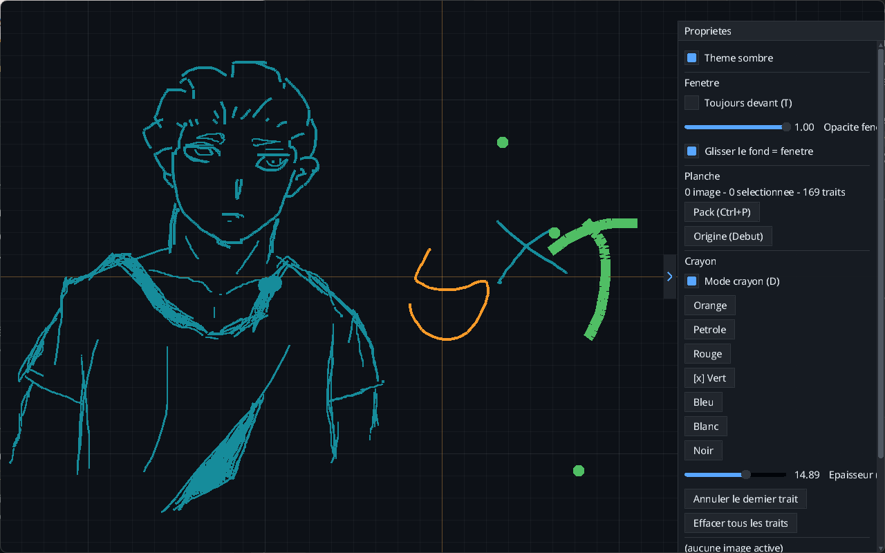

# REPONSE DE L'EXERCICE 9

> Les 2l2;ents de cette liste datent de la version 0.1.0 de NKRef et est rédigée le **12 / 09 / 2026**

Après utilisation de NRef, voici les liste des fonctionnalités et des attentes trouvées:

## **Liste des fonctionnalités** : 
 
 - **Dessin au crayon** : NKref permet de dessiner des traits presque net et d'une épaisseur controlée par l'utilisateur.

 - **Le choix des couleurs** : L'applicatopn propose différentes couleurs pour le dessin.

 - **L'enregistrement du projet** : Elle permet d'enregistrer un projet avec son extention native (`.nkref`)

 - **Le changement de thème global** : l'application fourni selon les préférence de l'utilisateur deux thèmes majeurs: le thème sombre et le thème clair.

 - **Le zoom sur le plan de travail** : il varie globalement entre **2%** et **6400%**

 - **L'annulation du dernier trait dessiné** : L'applicaton permet l'effacement du dernier trait ou encore de l'ensemble des traits dessinés par l'utilisateur en une fois.

 - **positionnement à l'écran** : l'application offre la possibilité d'être placée au premier plan en permanance ou peut tou simplement avoir un comportement classique en passant derrière une fenêtre selectionnée suite à la perte de son focus.

 ## Liste des attentes de NKRef

Même si l'application est déjà très bien, certaines fonctionnalitées supplémentaires contribueraient à l'amélioration de sa prise en main et la variété de tâche graphiques exécutables dessus.

 - **La possibilité de changer d'outil de dessin** : Le crayon est un outil basique qui satisfait dans une grande partie des cas, mais pas tous. Des outils comme un stylo caligraphique, un marqueur... permettrait de varier les effet obtensible sur les traits effectués avec NKRef.

 - **La variété du choix de couleur** : Les couleur prédéfinies sont déjà très belles et m'on fait même décovrir de nouvelles teintes. Toutefois, la possibilité d'avoir plus de liberté sur le choix de la couleur (une couleur avec un certain niveau d'opacité, de niveau de vert, rouge ou bleu) via un color picker par exemple donnerai plus de liberté artistique.

- **L'exportation en format d'image classique** : L'application n'exporte les fichier que sous son extension native comme évoquée plus haut, ce qui empêche la réutilisation de l'oeuvre à d'autres fins. l'idéale serait de pouvoir exporter le travail en **PNG**, **JPEG** ou **BMP**.

- **Le tracé de formes simples avec la souris** : être capable de dessiner des cercles, rectangles, segments de droites sans deoir produire trop d'efforts.

- **L'ajout d'une gomme** : L'ajout de la gomme est certainement l'une des fonctionnalités les plus utiles. car permettant d'effacer n'importe quel trait ou encore portion de trait indésirable, ce que les options d'effacement actuelles ne permettent pas proprement de faire. car en effet bouloir effacer l'avant dernier trait signifie effacer le dernier trait. trait qui peut être indispensable au dessin.

ci dessous une image du test effectué sur NKRef pendant environ 15 minutes.

- **Ce qui m'a fait prendre plus de 10 minutes pour le teste** : La principale raison de cette durée dans l'application était le fait que je cherchais un moyen de me déplacer librement dans la grille de l'application. Et j'ai malheureusement fini le test à ce moment là sans le découvir. J'ai aussi pris le temps d'examiner les possibilités de sauvegardes promises dans le champs gestes de l'application en nommant les fichiers sauvegardés avec une extension de fichier image classique (PNG) en vain.

