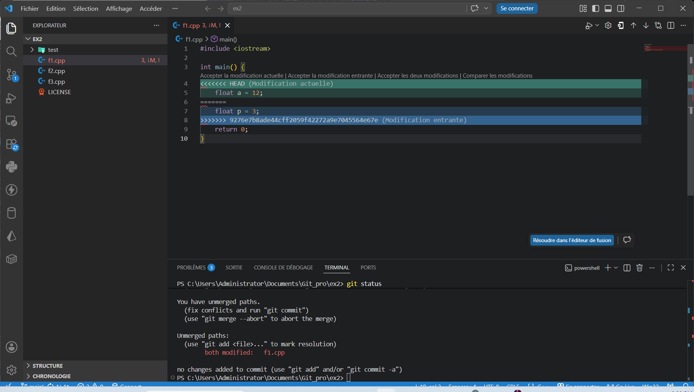

# REPONSE DE L'EXERCICE 6

> L'exercice 6 utilisera le dépôt `ex2` qu'on ne présente plus dans cette séire d'exercie. Pour le mené à bien, un second clone du dépôt a été réalisé sur la même machine.

## Clone du dépôt de `ex2` dans un nouveau répertoire

Pour le moment, le dépôt `ex2` existe en local et est accéssible via le chemin:
```
C:\Users\Administrator\Documents\Github\ex2
```
On nommera ce dépôt tout le long de l'exercice **dépôt initial**

- réalisation du clone vers un autre chemein: Le chemin choisi ici est :

```
C:\Users\Administrator\Documents\Git_pro\
```
commande exécuté dans le répertoire:

```
git clone https://github.com/Nyeck-Abondo/ex2.git

Cloning into 'ex2'...
remote: Enumerating objects: 35, done.
remote: Counting objects: 100% (35/35), done.
remote: Compressing objects: 100% (18/18), done.
remote: Total 35 (delta 14), reused 32 (delta 14), pack-reused 0 (from 0)
Receiving objects: 100% (35/35), 4.90 KiB | 1002.00 KiB/s, done.
Resolving deltas: 100% (14/14), done.
```
On nommera ce dépôt tout le long de l'exercice **dépôt secondaire**

## Modification du fichier `f1.cpp` dans les deux dépôt en y ajoutant des informations différentes

- **Etat intial du fichier dans les deux dépôts avant modification**:
```cpp
#include <iostream>

int main() {
    int a = 0;
    return 0;
}
```

- **Modification apportée dans le dépôt initial à la ligne 4** :

```cpp
#include <iostream>

int main() {
    float p = 3;
    return 0;
}
```

- **Modificatons apportée à la ligne 4 dans le dépôt secondaire** :

```cpp
#include <iostream>

int main() {
    int a = 12;
    return 0;
}
```

## Provocation du Refus

- **Indexation et commit dans le dépôt initial**:l'indexation et le commit ont été effectué dans cet ordre avec les sorties suivantes:

```
git add .

git commit -m "remplacement de la variable int a = 0 par float p = 3 dans le dépôt initial"

[main 9276e7b] remplacement de la variable int a = 0 par float p = 3 dans le dépôt initial
 1 file changed, 1 insertion(+), 1 deletion(-)
```

puis un push vers le dépôt distant a été effectué:

```
Enumerating objects: 5, done.
Counting objects: 100% (5/5), done.
Delta compression using up to 12 threads
Compressing objects: 100% (3/3), done.
Writing objects: 100% (3/3), 376 bytes | 376.00 KiB/s, done.
Total 3 (delta 1), reused 1 (delta 0), pack-reused 0 (from 0)
remote: Resolving deltas: 100% (1/1), completed with 1 local object.
To https://github.com/Nyeck-Abondo/ex2.git
   f9c3fe1..9276e7b  main -> main
```

- **Indexation et commit dans le dépôt secondaire**: Les commande et leurs sorties sont consécutivement listées ci dessous

```
git add .

git commit -m "feat: rempacement de float a = 0 par float a = 12 dans le dépôt secondaire"
[main 713e1de] feat: rempacement de float a = 0 par float a = 12 dans le dépôt secondaire
 1 file changed, 1 insertion(+), 1 deletion(-)
```

psuh vers le  dépôt distant :

```
git push
To https://github.com/Nyeck-Abondo/ex2.git
 ! [rejected]        main -> main (non-fast-forward)
error: failed to push some refs to 'https://github.com/Nyeck-Abondo/ex2.git'
hint: Updates were rejected because the tip of your current branch is behind
hint: its remote counterpart. If you want to integrate the remote changes,
hint: use 'git pull' before pushing again.
hint: See the 'Note about fast-forwards' in 'git push --help' for details.
```
ici, git indique un rejet de la mise à jour de la branche principale main à cause d'une ambibüité: **git ne sait pas quelle modification choisir**(abandonner les changements du dépôt distant et les remplacer par ceux ci, ou abandonner ceux du dépôt secondaire qui conserver ceux du dépôt distant).


## Provocation du conflit

Le conflit ici est provoqué ici par un simple pull des données présentes sur le dépôt distant.

```
git pull

Auto-merging f1.cpp
CONFLICT (content): Merge conflict in f1.cpp
Automatic merge failed; fix conflicts and then commit the result.
```

## Résolution du conflit

Ici on va se contenter de choisir dans l'éditeur VS code quel bloc de code conserver. Ici on choisira celui du dépôt **secondaire**.



- Ajout des changements et poussée vers le dépôt distant:

```
git add .

git status

On branch main
Your branch and 'origin/main' have diverged,
and have 1 and 1 different commits each, respectively.
  (use "git pull" if you want to integrate the remote branch with yours)

All conflicts fixed but you are still merging.
  (use "git commit" to conclude merge)

Changes to be committed:
        modified:   f1.cpp
```

le conflit est marqué ici comme résolu. il ne reste plus qu'à pousser:

```
git commit -m "feat: resolution du conflit des dépôts"

[main be257e7] feat: resolution du conflit des dépôts

git push

Enumerating objects: 8, done.
Counting objects: 100% (8/8), done.
Delta compression using up to 12 threads
Compressing objects: 100% (4/4), done.
Writing objects: 100% (4/4), 590 bytes | 590.00 KiB/s, done.
Total 4 (delta 1), reused 0 (delta 0), pack-reused 0 (from 0)
remote: Resolving deltas: 100% (1/1), completed with 1 local object.
To https://github.com/Nyeck-Abondo/ex2.git
   9276e7b..be257e7  main -> main
```

Le conflit est officiellement résolut.