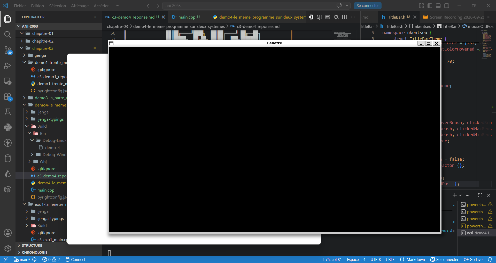

# REPONSE DE LA DEMO 4
> Afin de mener à bien cette démonstration un nouveau kit spécialement pour la cplateforme Linux a été créé. il se nomme LinuxKit et se trouve dans le dossier du chapitre.

> Cet exercice a été fait avec l'aide d'une Camarade du nom de Noumssi Tiatsap. Je me suis chargé de la saisie des commandes sur mon ordinateur et la description a été faite ensemble.

## Construction et lancement sur les différentes plateformes

>Les plateformes parcourues ici sont Linux au travers de WSL et windows 11.

### **Construction et lancement sous Windows**
- **Construction et lancement**
```
PS C:\Users\Administrator\Documents\Github\Sprints\ani-2053\chapitre-03\demo4-le_meme_programme_sur_deux_systemes> jenga rebuild 

╔══════════════════════════════════════════════════════════════════╗
║                                                                  ║
║                ██╗███████╗███╗   ██╗ ██████╗  █████╗             ║
║                ██║██╔════╝████╗  ██║██╔════╝ ██╔══██╗            ║
║                ██║█████╗  ██╔██╗ ██║██║  ███╗███████║            ║
║           ██   ██║██╔══╝  ██║╚██╗██║██║   ██║██╔══██║            ║
║           ╚█████╔╝███████╗██║ ╚████║╚██████╔╝██║  ██║            ║
║            ╚════╝ ╚══════╝╚═╝  ╚═══╝ ╚═════╝ ╚═╝  ╚═╝            ║
║                                                                  ║
║             Multi-platform C/C++ Build System v2.8.0             ║
║                                                                  ║
╚══════════════════════════════════════════════════════════════════╝

Removed C:\Users\Administrator\Documents\Github\Sprints\ani-2053\chapitre-03\demo4-le_meme_programme_sur_deux_systemes\Build\Bin\Debug-Windows\demo-4\demo-4.exe
Loading workspace...

Configuration: Debug
Target:        Windows x86_64
Toolchain:     clang-mingw

Build Order (1 projects):
  1. demo-4 [WINDOWED_APP]


╔══════════════════════════════════════════════════════════════════════════════════════════════╗
║  Project: demo-4                                                         Kind: WINDOWED_APP  ║
╚══════════════════════════════════════════════════════════════════════════════════════════════╝

ℹ Found 1 source file(s)
✓   [1/1] Compiled: main.cpp
ℹ Linking...
✓ Built: Build\Bin\Debug-Windows\demo-4\demo-4.exe

┌──────────────────────────────────────────────────────────────────────────────────────────────┐
│  ✓ Build Successful                                                             Time: 4.21s  │
└──────────────────────────────────────────────────────────────────────────────────────────────┘

════════════════════════════════════════════════════════════════════════════════
                                BUILD COMPLETED                                 
════════════════════════════════════════════════════════════════════════════════
Projects Built:  1/1
Time:           4.21s
Status:         ✓ SUCCESS
════════════════════════════════════════════════════════════════════════════════

PS C:\Users\Administrator\Documents\Github\Sprints\ani-2053\chapitre-03\demo4-le_meme_programme_sur_deux_systemes> jenga run

╔══════════════════════════════════════════════════════════════════╗
║                                                                  ║
║                ██╗███████╗███╗   ██╗ ██████╗  █████╗             ║
║                ██║██╔════╝████╗  ██║██╔════╝ ██╔══██╗            ║
║                ██║█████╗  ██╔██╗ ██║██║  ███╗███████║            ║
║           ██   ██║██╔══╝  ██║╚██╗██║██║   ██║██╔══██║            ║
║           ╚█████╔╝███████╗██║ ╚████║╚██████╔╝██║  ██║            ║
║            ╚════╝ ╚══════╝╚═╝  ╚═══╝ ╚═════╝ ╚═╝  ╚═╝            ║
║                                                                  ║
║             Multi-platform C/C++ Build System v2.8.0             ║
║                                                                  ║
╚══════════════════════════════════════════════════════════════════╝


━━━━━━━━━━━━━━━━━━━━━━━━━━━━━━━━━━━━━━━━━━━━━━━━━━━━━━━━━━━━━━━━━━━━━━━━━━━━━━━━
  ▶  EXECUTION  —  demo-4.exe
     C:\Users\Administrator\Documents\Github\Sprints\ani-2053\chapitre-03\demo4-le_meme_programme_sur_deux_systemes\Build\Bin\Debug-Windows\demo-4\demo-4.exe
━━━━━━━━━━━━━━━━━━━━━━━━━━━━━━━━━━━━━━━━━━━━━━━━━━━━━━━━━━━━━━━━━━━━━━━━━━━━━━━━


━━━━━━━━━━━━━━━━━━━━━━━━━━━━━━━━━━━━━━━━━━━━━━━━━━━━━━━━━━━━━━━━━━━━━━━━━━━━━━━━
  ◀  FIN D'EXECUTION  —  termine normalement  (19.53s)
━━━━━━━━━━━━━━━━━━━━━━━━━━━━━━━━━━━━━━━━━━━━━━━━━━━━━━━━━━━━━━━━━━━━━━━━━━━━━━━━
```

- **Présentation du rendu de la fenêtre sous windows: **


### **Construction et lancement sous Linux**

- **Construction** :
```
PS C:\Users\Administrator\Documents\Github\Sprints\ani-2053\chapitre-03\demo4-le_meme_programme_sur_deux_systemes> wsl
nyeck@CHINAMI-HLEMUKB:/mnt/c/Users/Administrator/Documents/Github/Sprints/ani-2053/chapitre-03/demo4-le_meme_programme_sur_deux_systemes$ jenga build --platform Linux

╔══════════════════════════════════════════════════════════════════╗
║                                                                  ║
║                ██╗███████╗███╗   ██╗ ██████╗  █████╗             ║
║                ██║██╔════╝████╗  ██║██╔════╝ ██╔══██╗            ║
║                ██║█████╗  ██╔██╗ ██║██║  ███╗███████║            ║
║           ██   ██║██╔══╝  ██║╚██╗██║██║   ██║██╔══██║            ║
║           ╚█████╔╝███████╗██║ ╚████║╚██████╔╝██║  ██║            ║
║            ╚════╝ ╚══════╝╚═╝  ╚═══╝ ╚═════╝ ╚═╝  ╚═╝            ║
║                                                                  ║
║             Multi-platform C/C++ Build System v2.8.4             ║
║                                                                  ║
╚══════════════════════════════════════════════════════════════════╝

Loading workspace...

Configuration: Debug
Target:        Linux x86_64
Toolchain:     host-clang

Build Order (1 projects):
  1. demo-4 [WINDOWED_APP]


╔══════════════════════════════════════════════════════════════════════════════════════════════╗
║  Project: demo-4                                                         Kind: WINDOWED_APP  ║
╚══════════════════════════════════════════════════════════════════════════════════════════════╝

ℹ Found 1 source file(s)
✓   [1/1] Compiled: main.cpp
ℹ Linking...
✓ Built: Build/Bin/Debug-Linux/demo-4/demo-4

┌──────────────────────────────────────────────────────────────────────────────────────────────┐
│  ✓ Build Successful                                                             Time: 4.49s  │
└──────────────────────────────────────────────────────────────────────────────────────────────┘

════════════════════════════════════════════════════════════════════════════════
                                BUILD COMPLETED                                 
════════════════════════════════════════════════════════════════════════════════
Projects Built:  1/1
Time:           4.49s
Status:         ✓ SUCCESS
════════════════════════════════════════════════════════════════════════════════
```
- **Exécution** :
```
nyeck@CHINAMI-HLEMUKB:/mnt/c/Users/Administrator/Documents/Github/Sprints/ani-2053/chapitre-03/demo4-le_meme_programme_sur_deux_systemes$ jenga run --platform Linux

╔══════════════════════════════════════════════════════════════════╗
║                                                                  ║
║                ██╗███████╗███╗   ██╗ ██████╗  █████╗             ║
║                ██║██╔════╝████╗  ██║██╔════╝ ██╔══██╗            ║
║                ██║█████╗  ██╔██╗ ██║██║  ███╗███████║            ║
║           ██   ██║██╔══╝  ██║╚██╗██║██║   ██║██╔══██║            ║
║           ╚█████╔╝███████╗██║ ╚████║╚██████╔╝██║  ██║            ║
║            ╚════╝ ╚══════╝╚═╝  ╚═══╝ ╚═════╝ ╚═╝  ╚═╝            ║
║                                                                  ║
║             Multi-platform C/C++ Build System v2.8.4             ║
║                                                                  ║
╚══════════════════════════════════════════════════════════════════╝


━━━━━━━━━━━━━━━━━━━━━━━━━━━━━━━━━━━━━━━━━━━━━━━━━━━━━━━━━━━━━━━━━━━━━━━━━━━━━━━━
  ▶  EXECUTION  —  demo-4
     /mnt/c/Users/Administrator/Documents/Github/Sprints/ani-2053/chapitre-03/demo4-le_meme_programme_sur_deux_systemes/Build/Bin/Debug-Linux/demo-4/demo-4
━━━━━━━━━━━━━━━━━━━━━━━━━━━━━━━━━━━━━━━━━━━━━━━━━━━━━━━━━━━━━━━━━━━━━━━━━━━━━━━━


━━━━━━━━━━━━━━━━━━━━━━━━━━━━━━━━━━━━━━━━━━━━━━━━━━━━━━━━━━━━━━━━━━━━━━━━━━━━━━━━
  ◀  FIN D'EXECUTION  —  termine normalement  (2.99s)
━━━━━━━━━━━━━━━━━━━━━━━━━━━━━━━━━━━━━━━━━━━━━━━━━━━━━━━━━━━━━━━━━━━━━━━━━━━━━━━━
```

- **Présentation de la fenêtre sous Linux** :


## Différences observées entre les deux exécutions et constructions

- **Aspect de la fenêtre sur les différents systèmes** :
    - LEs bordures : Les bordures de la fenêtre sous Ubuntu 22.04LTS lancé sur WSL2 sous windows se présentent avec une épaisseur plus significative que les bordures sur la fenêtre Windows.
    - La barre de Titre : LA barre de tire sous linux se présente comme étant moins épaisse que la barre de titre de Window. Par ailleurs une seconde différence se voit au niveau de la position du titre de la fenêtre. Sur linux le titre est au milieu tandis que sur windows il se présente sur le coin gauche.
    - Icone d'application : L'icone sur Linux par défaut présente un simple cadre blanc et noir contre une icone avec des points lignes vertes et blanches.

- **Binaires produits** :
    - Les bibliothèques : Les bibliothèques contruites sous linus sont d'extension `.a` 
    - Les exécutables: sous windows, l'exécutable se présente avec une extension `.exe` puis ous linux il se présente sans aucune extensions.

En définitive, on peut remarquer que les programmes exécutés d'une plateforme à l'autre présentent des divergences aussi bien sur le point de vue esthétique que fonctionnel.