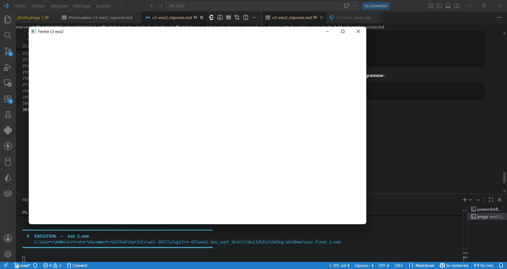

# REPONSE DE L'EXERCICE 3

> Dans cet Exercice, l'on ne créera qu'une seule variable NKWindow dont on se contentera de changer les configurations pour plus de lisibilité dans le code. On s'assurera toute fois de pouvoir fermer la fenêtre dans certains cas avec la touche `F` du clavier. L'exercice est fait depuis le dépôt ANI-2053 grâce au nkentseuKit créé au préalable depuis la copie locale du dépôt de Nkentseu.

## Retrait des droits des fenêtres

### Passage à false du champ resizable des configurations

- **Etat du fichier source** :
```cpp
#include "NKWindow/NKWindow.h"
#include "NKWindow/NKMain.h"
#include "NKEvent/NkEvent.h"
#include "NKEvent/NkWindowEvent.h"
#include "NKEvent/NkKeyboardEvent.h"

using namespace nkentseu;

int nkmain(const NkEntryState& state) {
    NkWindowConfig cfg;
    cfg.title           =   "Fentre c3 exo2";
    cfg.width           =   1280;
    cfg.height          =   720;
    cfg.resizable       =   false;
    cfg.movable         =   true;
    cfg.centered        =   true;
    cfg.closable        =   true;
    cfg.minimizable     =   true;
    cfg.maximizable     =   true;
    cfg.canFullscreen   =   true;
    
    NkWindow window(cfg);
    if (!window.IsOpen()) {
        logger.Error("Erreur de création de la fenêtre");
        return -1;
    }
    while (window.IsOpen()) {
        while (NkEvent* e = NkEvents().PollEvent()) {
            if (e->Is<NkWindowCloseEvent>())
                window.Close();
            if (auto* key = e->As<NkKeyPressEvent>()) {
                if (key->GetKey() == NkKey::NK_F)
                    window.Close();
            }
        }
    }
    return 0;
}

```

- **construction et lancement du programme** :

```
jenga build

╔══════════════════════════════════════════════════════════════════╗
║                                                                  ║
║                ██╗███████╗███╗   ██╗ ██████╗  █████╗             ║
║                ██║██╔════╝████╗  ██║██╔════╝ ██╔══██╗            ║
║                ██║█████╗  ██╔██╗ ██║██║  ███╗███████║            ║
║           ██   ██║██╔══╝  ██║╚██╗██║██║   ██║██╔══██║            ║
║           ╚█████╔╝███████╗██║ ╚████║╚██████╔╝██║  ██║            ║
║            ╚════╝ ╚══════╝╚═╝  ╚═══╝ ╚═════╝ ╚═╝  ╚═╝            ║
║                                                                  ║
║             Multi-platform C/C++ Build System v2.8.0             ║
║                                                                  ║
╚══════════════════════════════════════════════════════════════════╝

Loading workspace...

Configuration: Debug
Target:        Windows x86_64
Toolchain:     clang-mingw

Build Order (1 projects):
  1. exo 2 [WINDOWED_APP]


╔══════════════════════════════════════════════════════════════════════════════════════════════╗
║  Project: exo 2                                                          Kind: WINDOWED_APP  ║
╚══════════════════════════════════════════════════════════════════════════════════════════════╝

ℹ Found 1 source file(s)
✓   [1/1] Compiled: c3-exo2_main.cpp
ℹ Linking...
✓ Built: Build\Bin\Debug-Windows\exo 2\exo 2.exe

┌──────────────────────────────────────────────────────────────────────────────────────────────┐
│  ✓ Build Successful                                                             Time: 3.72s  │
└──────────────────────────────────────────────────────────────────────────────────────────────┘

════════════════════════════════════════════════════════════════════════════════
                                BUILD COMPLETED                                 
════════════════════════════════════════════════════════════════════════════════
Projects Built:  1/1
Time:           3.72s
Status:         ✓ SUCCESS
════════════════════════════════════════════════════════════════════════════════

PS C:\Users\Administrator\Documents\Github\Sprints\ani-2053\chapitre-03\exo2-les_sept_droits> jenga run

╔══════════════════════════════════════════════════════════════════╗
║                                                                  ║
║                ██╗███████╗███╗   ██╗ ██████╗  █████╗             ║
║                ██║██╔════╝████╗  ██║██╔════╝ ██╔══██╗            ║
║                ██║█████╗  ██╔██╗ ██║██║  ███╗███████║            ║
║           ██   ██║██╔══╝  ██║╚██╗██║██║   ██║██╔══██║            ║
║           ╚█████╔╝███████╗██║ ╚████║╚██████╔╝██║  ██║            ║
║            ╚════╝ ╚══════╝╚═╝  ╚═══╝ ╚═════╝ ╚═╝  ╚═╝            ║
║                                                                  ║
║             Multi-platform C/C++ Build System v2.8.0             ║
║                                                                  ║
╚══════════════════════════════════════════════════════════════════╝


━━━━━━━━━━━━━━━━━━━━━━━━━━━━━━━━━━━━━━━━━━━━━━━━━━━━━━━━━━━━━━━━━━━━━━━━━━━━━━━━
  ▶  EXECUTION  —  exo 2.exe
     C:\Users\Administrator\Documents\Github\Sprints\ani-2053\chapitre-03\exo2-les_sept_droits\Build\Bin\Debug-Windows\exo 2\exo 2.exe
━━━━━━━━━━━━━━━━━━━━━━━━━━━━━━━━━━━━━━━━━━━━━━━━━━━━━━━━━━━━━━━━━━━━━━━━━━━━━━━━


━━━━━━━━━━━━━━━━━━━━━━━━━━━━━━━━━━━━━━━━━━━━━━━━━━━━━━━━━━━━━━━━━━━━━━━━━━━━━━━━
  ◀  FIN D'EXECUTION  —  termine normalement  (6.66s)
━━━━━━━━━━━━━━━━━━━━━━━━━━━━━━━━━━━━━━━━━━━━━━━━━━━━━━━━━━━━━━━━━━━━━━━━━━━━━━━━
```

Ici on observe après lancement de l'excutable, que le redimensionnement de la fenêtre est toujours possible, mais que la zone cliente de celle ci qui est repeinte est toujours aux même dimensions que celle décrite dans la configuration initiale de la structure `NkWindowConfig`. Cette perte de surface de peinture de l'écran tant dûe à l'abscence de rendrer.

### Passage à false du champ movable

- **Etat du fichier source** :
```cpp
#include "NKWindow/NKWindow.h"
#include "NKWindow/NKMain.h"
#include "NKEvent/NkEvent.h"
#include "NKEvent/NkWindowEvent.h"
#include "NKEvent/NkKeyboardEvent.h"

using namespace nkentseu;

int nkmain(const NkEntryState& state) {
    NkWindowConfig cfg;
    cfg.title           =   "Fentre c3 exo2";
    cfg.width           =   1280;
    cfg.height          =   720;
    cfg.resizable       =   true;
    cfg.movable         =   false;
    cfg.centered        =   true;
    cfg.closable        =   true;
    cfg.minimizable     =   true;
    cfg.maximizable     =   true;
    cfg.canFullscreen   =   true;
    
    NkWindow window(cfg);
    if (!window.IsOpen()) {
        logger.Error("Erreur de création de la fenêtre");
        return -1;
    }
    while (window.IsOpen()) {
        while (NkEvent* e = NkEvents().PollEvent()) {
            if (e->Is<NkWindowCloseEvent>())
                window.Close();
            if (auto* key = e->As<NkKeyPressEvent>()) {
                if (key->GetKey() == NkKey::NK_F)
                    window.Close();
            }
        }
    }
    return 0;
}

```
- **Construction et lancement du programme** : afin d'éviter la répétition, la construction du programme a réussie dans ce cas aussi.
```
jenga build

╔══════════════════════════════════════════════════════════════════╗
║                                                                  ║
║                ██╗███████╗███╗   ██╗ ██████╗  █████╗             ║
║                ██║██╔════╝████╗  ██║██╔════╝ ██╔══██╗            ║
║                ██║█████╗  ██╔██╗ ██║██║  ███╗███████║            ║
║           ██   ██║██╔══╝  ██║╚██╗██║██║   ██║██╔══██║            ║
║           ╚█████╔╝███████╗██║ ╚████║╚██████╔╝██║  ██║            ║
║            ╚════╝ ╚══════╝╚═╝  ╚═══╝ ╚═════╝ ╚═╝  ╚═╝            ║
║                                                                  ║
║             Multi-platform C/C++ Build System v2.8.0             ║
║                                                                  ║
╚══════════════════════════════════════════════════════════════════╝

Loading workspace...

Configuration: Debug
Target:        Windows x86_64
Toolchain:     clang-mingw

Build Order (1 projects):
  1. exo 2 [WINDOWED_APP]


╔══════════════════════════════════════════════════════════════════════════════════════════════╗
║  Project: exo 2                                                          Kind: WINDOWED_APP  ║
╚══════════════════════════════════════════════════════════════════════════════════════════════╝

ℹ Found 1 source file(s)
✓   [1/1] Compiled: c3-exo2_main.cpp
ℹ Linking...
✓ Built: Build\Bin\Debug-Windows\exo 2\exo 2.exe

┌──────────────────────────────────────────────────────────────────────────────────────────────┐
│  ✓ Build Successful                                                             Time: 2.60s  │
└──────────────────────────────────────────────────────────────────────────────────────────────┘

════════════════════════════════════════════════════════════════════════════════
                                BUILD COMPLETED                                 
════════════════════════════════════════════════════════════════════════════════
Projects Built:  1/1
Time:           2.60s
Status:         ✓ SUCCESS
════════════════════════════════════════════════════════════════════════════════

PS C:\Users\Administrator\Documents\Github\Sprints\ani-2053\chapitre-03\exo2-les_sept_droits> jenga run  

╔══════════════════════════════════════════════════════════════════╗
║                                                                  ║
║                ██╗███████╗███╗   ██╗ ██████╗  █████╗             ║
║                ██║██╔════╝████╗  ██║██╔════╝ ██╔══██╗            ║
║                ██║█████╗  ██╔██╗ ██║██║  ███╗███████║            ║
║           ██   ██║██╔══╝  ██║╚██╗██║██║   ██║██╔══██║            ║
║           ╚█████╔╝███████╗██║ ╚████║╚██████╔╝██║  ██║            ║
║            ╚════╝ ╚══════╝╚═╝  ╚═══╝ ╚═════╝ ╚═╝  ╚═╝            ║
║                                                                  ║
║             Multi-platform C/C++ Build System v2.8.0             ║
║                                                                  ║
╚══════════════════════════════════════════════════════════════════╝


━━━━━━━━━━━━━━━━━━━━━━━━━━━━━━━━━━━━━━━━━━━━━━━━━━━━━━━━━━━━━━━━━━━━━━━━━━━━━━━━
  ▶  EXECUTION  —  exo 2.exe
     C:\Users\Administrator\Documents\Github\Sprints\ani-2053\chapitre-03\exo2-les_sept_droits\Build\Bin\Debug-Windows\exo 2\exo 2.exe
━━━━━━━━━━━━━━━━━━━━━━━━━━━━━━━━━━━━━━━━━━━━━━━━━━━━━━━━━━━━━━━━━━━━━━━━━━━━━━━━


━━━━━━━━━━━━━━━━━━━━━━━━━━━━━━━━━━━━━━━━━━━━━━━━━━━━━━━━━━━━━━━━━━━━━━━━━━━━━━━━
  ◀  FIN D'EXECUTION  —  termine normalement  (8.17s)
━━━━━━━━━━━━━━━━━━━━━━━━━━━━━━━━━━━━━━━━━━━━━━━━━━━━━━━━━━━━━━━━━━━━━━━━━━━━━━━━
```

- **Observations** : J'ai pu observer que la fenêtre pouvait toujours être parfaitement déplacée sur toute la surface de l'écran.

### Passage à False du champ centered :

- **Etat du fichier source** :

```cpp
#include "NKWindow/NKWindow.h"
#include "NKWindow/NKMain.h"
#include "NKEvent/NkEvent.h"
#include "NKEvent/NkWindowEvent.h"
#include "NKEvent/NkKeyboardEvent.h"

using namespace nkentseu;

int nkmain(const NkEntryState& state) {
    NkWindowConfig cfg;
    cfg.title           =   "Fentre c3 exo2";
    cfg.width           =   1280;
    cfg.height          =   720;
    cfg.resizable       =   true;
    cfg.movable         =   true;
    cfg.centered        =   false;
    cfg.closable        =   true;
    cfg.minimizable     =   true;
    cfg.maximizable     =   true;
    cfg.canFullscreen   =   true;
    
    NkWindow window;
    if (!window.Create(cfg)) {
        logger.Error("Erreur de création de la fenêtre");
        return -1;
    }
    while (window.IsOpen()) {
        while (NkEvent* e = NkEvents().PollEvent()) {
            if (e->Is<NkWindowCloseEvent>())
                window.Close();
            if (auto* key = e->As<NkKeyPressEvent>()) {
                if (key->GetKey() == NkKey::NK_F)
                    window.Close();
            }
        }
    }
    return 0;
}

```

- **Construction et lancement du programme** :

```
╔══════════════════════════════════════════════════════════════════════════════════════════════╗
║  Project: exo 2                                                          Kind: WINDOWED_APP  ║
╚══════════════════════════════════════════════════════════════════════════════════════════════╝

ℹ Found 1 source file(s)
✓   [1/1] Compiled: c3-exo2_main.cpp
ℹ Linking...
✓ Built: Build\Bin\Debug-Windows\exo 2\exo 2.exe

┌──────────────────────────────────────────────────────────────────────────────────────────────┐
│  ✓ Build Successful                                                             Time: 2.35s  │
└──────────────────────────────────────────────────────────────────────────────────────────────┘

════════════════════════════════════════════════════════════════════════════════
                                BUILD COMPLETED                                 
════════════════════════════════════════════════════════════════════════════════
Projects Built:  1/1
Time:           2.36s
Status:         ✓ SUCCESS
════════════════════════════════════════════════════════════════════════════════

PS C:\Users\Administrator\Documents\Github\Sprints\ani-2053\chapitre-03\exo2-les_sept_droits> jenga run

╔══════════════════════════════════════════════════════════════════╗
║                                                                  ║
║                ██╗███████╗███╗   ██╗ ██████╗  █████╗             ║
║                ██║██╔════╝████╗  ██║██╔════╝ ██╔══██╗            ║
║                ██║█████╗  ██╔██╗ ██║██║  ███╗███████║            ║
║           ██   ██║██╔══╝  ██║╚██╗██║██║   ██║██╔══██║            ║
║           ╚█████╔╝███████╗██║ ╚████║╚██████╔╝██║  ██║            ║
║            ╚════╝ ╚══════╝╚═╝  ╚═══╝ ╚═════╝ ╚═╝  ╚═╝            ║
║                                                                  ║
║             Multi-platform C/C++ Build System v2.8.0             ║
║                                                                  ║
╚══════════════════════════════════════════════════════════════════╝


━━━━━━━━━━━━━━━━━━━━━━━━━━━━━━━━━━━━━━━━━━━━━━━━━━━━━━━━━━━━━━━━━━━━━━━━━━━━━━━━
  ▶  EXECUTION  —  exo 2.exe
     C:\Users\Administrator\Documents\Github\Sprints\ani-2053\chapitre-03\exo2-les_sept_droits\Build\Bin\Debug-Windows\exo 2\exo 2.exe
━━━━━━━━━━━━━━━━━━━━━━━━━━━━━━━━━━━━━━━━━━━━━━━━━━━━━━━━━━━━━━━━━━━━━━━━━━━━━━━━


━━━━━━━━━━━━━━━━━━━━━━━━━━━━━━━━━━━━━━━━━━━━━━━━━━━━━━━━━━━━━━━━━━━━━━━━━━━━━━━━
  ◀  FIN D'EXECUTION  —  termine normalement  (90.91s)
━━━━━━━━━━━━━━━━━━━━━━━━━━━━━━━━━━━━━━━━━━━━━━━━━━━━━━━━━━━━━━━━━━━━━━━━━━━━━━━━
```

- **Observation** : On observe ici que la fenêtre apparait en étant quelque peu décalée vers la gauche de l'écran.
- **Preuve** : 


### Passage à False du champ `closable`

- **Etat du fichier source** :
```cpp
#include "NKWindow/NKWindow.h"
#include "NKWindow/NKMain.h"
#include "NKEvent/NkEvent.h"
#include "NKEvent/NkWindowEvent.h"
#include "NKEvent/NkKeyboardEvent.h"

using namespace nkentseu;

int nkmain(const NkEntryState& state) {
    NkWindowConfig cfg;
    cfg.title           =   "Fentre c3 exo2";
    cfg.width           =   1280;
    cfg.height          =   720;
    cfg.resizable       =   true;
    cfg.movable         =   true;
    cfg.centered        =   true;
    cfg.closable        =   false;
    cfg.minimizable     =   true;
    cfg.maximizable     =   true;
    cfg.canFullscreen   =   true;
    
    NkWindow window;
    if (!window.Create(cfg)) {
        logger.Error("Erreur de création de la fenêtre");
        return -1;
    }
    while (window.IsOpen()) {
        while (NkEvent* e = NkEvents().PollEvent()) {
            if (e->Is<NkWindowCloseEvent>())
                window.Close();
            if (auto* key = e->As<NkKeyPressEvent>()) {
                if (key->GetKey() == NkKey::NK_F)
                    window.Close();
            }
        }
    }
    return 0;
}

```

C'est ici que la seconde méthode de fermeture propre de la fenêtre sera utilisée.

- **construction et lancement de l'exécutable** :

```
╔══════════════════════════════════════════════════════════════════════════════════════════════╗
║  Project: exo 2                                                          Kind: WINDOWED_APP  ║
╚══════════════════════════════════════════════════════════════════════════════════════════════╝

ℹ Found 1 source file(s)
✓   [1/1] Compiled: c3-exo2_main.cpp
ℹ Linking...
✓ Built: Build\Bin\Debug-Windows\exo 2\exo 2.exe

┌──────────────────────────────────────────────────────────────────────────────────────────────┐
│  ✓ Build Successful                                                             Time: 2.40s  │
└──────────────────────────────────────────────────────────────────────────────────────────────┘

════════════════════════════════════════════════════════════════════════════════
                                BUILD COMPLETED                                 
════════════════════════════════════════════════════════════════════════════════
Projects Built:  1/1
Time:           2.40s
Status:         ✓ SUCCESS
════════════════════════════════════════════════════════════════════════════════

PS C:\Users\Administrator\Documents\Github\Sprints\ani-2053\chapitre-03\exo2-les_sept_droits> jenga run  

╔══════════════════════════════════════════════════════════════════╗
║                                                                  ║
║                ██╗███████╗███╗   ██╗ ██████╗  █████╗             ║
║                ██║██╔════╝████╗  ██║██╔════╝ ██╔══██╗            ║
║                ██║█████╗  ██╔██╗ ██║██║  ███╗███████║            ║
║           ██   ██║██╔══╝  ██║╚██╗██║██║   ██║██╔══██║            ║
║           ╚█████╔╝███████╗██║ ╚████║╚██████╔╝██║  ██║            ║
║            ╚════╝ ╚══════╝╚═╝  ╚═══╝ ╚═════╝ ╚═╝  ╚═╝            ║
║                                                                  ║
║             Multi-platform C/C++ Build System v2.8.0             ║
║                                                                  ║
╚══════════════════════════════════════════════════════════════════╝


━━━━━━━━━━━━━━━━━━━━━━━━━━━━━━━━━━━━━━━━━━━━━━━━━━━━━━━━━━━━━━━━━━━━━━━━━━━━━━━━
  ▶  EXECUTION  —  exo 2.exe
     C:\Users\Administrator\Documents\Github\Sprints\ani-2053\chapitre-03\exo2-les_sept_droits\Build\Bin\Debug-Windows\exo 2\exo 2.exe
━━━━━━━━━━━━━━━━━━━━━━━━━━━━━━━━━━━━━━━━━━━━━━━━━━━━━━━━━━━━━━━━━━━━━━━━━━━━━━━━


━━━━━━━━━━━━━━━━━━━━━━━━━━━━━━━━━━━━━━━━━━━━━━━━━━━━━━━━━━━━━━━━━━━━━━━━━━━━━━━━
  ◀  FIN D'EXECUTION  —  termine normalement  (60.83s)
━━━━━━━━━━━━━━━━━━━━━━━━━━━━━━━━━━━━━━━━━━━━━━━━━━━━━━━━━━━━━━━━━━━━━━━━━━━━━━━━
```

- **Observations faites** : Pour le cas de cette expérience, En gardant le fichier tel quel, la fenêtre dispose encore de la possibilité de se fermer en cliquant sur le bouton de croix sur sa barre de titre. par contre, dans les deux cas suivant, la fenêtre adopte le comportement contraire en refusant la possibilité de se fermer de cette manière.

    - **En retirant l'évènement de fermeture de fenêtre basé sur le message `NKWindowCloseEvent`** : En retirant la ligne 
    ```cpp
        if (e->Is<NkWindowCloseEvent>())
                window.Close();
    ```
    Et en conservant la configuration précédente de cosable à false, la fenêtre ne se ferme plus de la manière conventionnelle. seul le mode secondaire de fermeture avec la touche `F` prévu pour ce genre de situation permet sa fermeture.

    - **En retirant l'évènement de fermeture de fenêtre basé sur le message `NKWindowCloseEvent`, et en remettant à `true` le champ closable** : Ici encore, le même comportement de la fenêtre est constaté. Elle ne se ferme qu'avec l'appuis unique sur la touche `F` prévue en cas de fermeture propre de secour.

### Passage à False du champ `minimizable`

- **Etat du fichier source** :
```cpp
#include "NKWindow/NKWindow.h"
#include "NKWindow/NKMain.h"
#include "NKEvent/NkEvent.h"
#include "NKEvent/NkWindowEvent.h"
#include "NKEvent/NkKeyboardEvent.h"

using namespace nkentseu;

int nkmain(const NkEntryState& state) {
    NkWindowConfig cfg;
    cfg.title           =   "Fentre c3 exo2";
    cfg.width           =   1280;
    cfg.height          =   720;
    cfg.resizable       =   true;
    cfg.movable         =   true;
    cfg.centered        =   true;
    cfg.closable        =   true;
    cfg.minimizable     =   false;
    cfg.maximizable     =   true;
    cfg.canFullscreen   =   true;
    
    NkWindow window;
    if (!window.Create(cfg)) {
        logger.Error("Erreur de création de la fenêtre");
        return -1;
    }
    while (window.IsOpen()) {
        while (NkEvent* e = NkEvents().PollEvent()) {
            if (auto* key = e->As<NkKeyPressEvent>()) {
                if (key->GetKey() == NkKey::NK_F)
                    window.Close();
            }
        }
    }
    return 0;
}

```

- **construction et lancement de l'exécutable** :

```
╔══════════════════════════════════════════════════════════════════════════════════════════════╗
║  Project: exo 2                                                          Kind: WINDOWED_APP  ║
╚══════════════════════════════════════════════════════════════════════════════════════════════╝

ℹ Found 1 source file(s)
✓   [1/1] Compiled: c3-exo2_main.cpp
ℹ Linking...
✓ Built: Build\Bin\Debug-Windows\exo 2\exo 2.exe

┌──────────────────────────────────────────────────────────────────────────────────────────────┐
│  ✓ Build Successful                                                             Time: 2.45s  │
└──────────────────────────────────────────────────────────────────────────────────────────────┘

════════════════════════════════════════════════════════════════════════════════
                                BUILD COMPLETED                                 
════════════════════════════════════════════════════════════════════════════════
Projects Built:  1/1
Time:           2.45s
Status:         ✓ SUCCESS
════════════════════════════════════════════════════════════════════════════════

PS C:\Users\Administrator\Documents\Github\Sprints\ani-2053\chapitre-03\exo2-les_sept_droits> jenga run  

╔══════════════════════════════════════════════════════════════════╗
║                                                                  ║
║                ██╗███████╗███╗   ██╗ ██████╗  █████╗             ║
║                ██║██╔════╝████╗  ██║██╔════╝ ██╔══██╗            ║
║                ██║█████╗  ██╔██╗ ██║██║  ███╗███████║            ║
║           ██   ██║██╔══╝  ██║╚██╗██║██║   ██║██╔══██║            ║
║           ╚█████╔╝███████╗██║ ╚████║╚██████╔╝██║  ██║            ║
║            ╚════╝ ╚══════╝╚═╝  ╚═══╝ ╚═════╝ ╚═╝  ╚═╝            ║
║                                                                  ║
║             Multi-platform C/C++ Build System v2.8.0             ║
║                                                                  ║
╚══════════════════════════════════════════════════════════════════╝


━━━━━━━━━━━━━━━━━━━━━━━━━━━━━━━━━━━━━━━━━━━━━━━━━━━━━━━━━━━━━━━━━━━━━━━━━━━━━━━━
  ▶  EXECUTION  —  exo 2.exe
     C:\Users\Administrator\Documents\Github\Sprints\ani-2053\chapitre-03\exo2-les_sept_droits\Build\Bin\Debug-Windows\exo 2\exo 2.exe
━━━━━━━━━━━━━━━━━━━━━━━━━━━━━━━━━━━━━━━━━━━━━━━━━━━━━━━━━━━━━━━━━━━━━━━━━━━━━━━━


━━━━━━━━━━━━━━━━━━━━━━━━━━━━━━━━━━━━━━━━━━━━━━━━━━━━━━━━━━━━━━━━━━━━━━━━━━━━━━━━
  ◀  FIN D'EXECUTION  —  termine normalement  (15.68s)
━━━━━━━━━━━━━━━━━━━━━━━━━━━━━━━━━━━━━━━━━━━━━━━━━━━━━━━━━━━━━━━━━━━━━━━━━━━━━━━━
```

- **Observations faites** : Pareil que dans le cas précédent, la fenêtre est encore minimisable avec les boutons présents juste à côté de celui de la croix. l'opération a été effectuée deux fois, dans deux conditions avant l'écriture du rendu. 
    - **Sans suppression préalable du dossier de Build**
    - **Après suppression du dossier de build**

Dans les deux cas, aucun changement n'a été observé. La fenêtre repondait normalement aux opération de minimisatoin et de maximisation comme si aucune restriction ne lui était appliquée.

### Passage à false du champs `maximizable`

- **Etat du fichier source** :
```cpp
#include "NKWindow/NKWindow.h"
#include "NKWindow/NKMain.h"
#include "NKEvent/NkEvent.h"
#include "NKEvent/NkWindowEvent.h"
#include "NKEvent/NkKeyboardEvent.h"

using namespace nkentseu;

int nkmain(const NkEntryState& state) {
    NkWindowConfig cfg;
    cfg.title           =   "Fentre c3 exo2";
    cfg.width           =   1280;
    cfg.height          =   720;
    cfg.resizable       =   true;
    cfg.movable         =   true;
    cfg.centered        =   true;
    cfg.closable        =   true;
    cfg.minimizable     =   true;
    cfg.maximizable     =   false;
    cfg.canFullscreen   =   true;
    
    NkWindow window;
    if (!window.Create(cfg)) {
        logger.Error("Erreur de création de la fenêtre");
        return -1;
    }
    while (window.IsOpen()) {
        while (NkEvent* e = NkEvents().PollEvent()) {
            if (auto* key = e->As<NkKeyPressEvent>()) {
                if (key->GetKey() == NkKey::NK_F)
                    window.Close();
            }
        }
    }
    return 0;
}

```

- **construction et lancement de l'exécutable** :

```
╔══════════════════════════════════════════════════════════════════════════════════════════════╗
║  Project: exo 2                                                          Kind: WINDOWED_APP  ║
╚══════════════════════════════════════════════════════════════════════════════════════════════╝

ℹ Found 1 source file(s)
✓   [1/1] Compiled: c3-exo2_main.cpp
ℹ Linking...
✓ Built: Build\Bin\Debug-Windows\exo 2\exo 2.exe

┌──────────────────────────────────────────────────────────────────────────────────────────────┐
│  ✓ Build Successful                                                             Time: 2.35s  │
└──────────────────────────────────────────────────────────────────────────────────────────────┘

════════════════════════════════════════════════════════════════════════════════
                                BUILD COMPLETED                                 
════════════════════════════════════════════════════════════════════════════════
Projects Built:  1/1
Time:           2.35s
Status:         ✓ SUCCESS
════════════════════════════════════════════════════════════════════════════════

PS C:\Users\Administrator\Documents\Github\Sprints\ani-2053\chapitre-03\exo2-les_sept_droits> jenga run

╔══════════════════════════════════════════════════════════════════╗
║                                                                  ║
║                ██╗███████╗███╗   ██╗ ██████╗  █████╗             ║
║                ██║██╔════╝████╗  ██║██╔════╝ ██╔══██╗            ║
║                ██║█████╗  ██╔██╗ ██║██║  ███╗███████║            ║
║           ██   ██║██╔══╝  ██║╚██╗██║██║   ██║██╔══██║            ║
║           ╚█████╔╝███████╗██║ ╚████║╚██████╔╝██║  ██║            ║
║            ╚════╝ ╚══════╝╚═╝  ╚═══╝ ╚═════╝ ╚═╝  ╚═╝            ║
║                                                                  ║
║             Multi-platform C/C++ Build System v2.8.0             ║
║                                                                  ║
╚══════════════════════════════════════════════════════════════════╝


━━━━━━━━━━━━━━━━━━━━━━━━━━━━━━━━━━━━━━━━━━━━━━━━━━━━━━━━━━━━━━━━━━━━━━━━━━━━━━━━
  ▶  EXECUTION  —  exo 2.exe
     C:\Users\Administrator\Documents\Github\Sprints\ani-2053\chapitre-03\exo2-les_sept_droits\Build\Bin\Debug-Windows\exo 2\exo 2.exe
━━━━━━━━━━━━━━━━━━━━━━━━━━━━━━━━━━━━━━━━━━━━━━━━━━━━━━━━━━━━━━━━━━━━━━━━━━━━━━━━


━━━━━━━━━━━━━━━━━━━━━━━━━━━━━━━━━━━━━━━━━━━━━━━━━━━━━━━━━━━━━━━━━━━━━━━━━━━━━━━━
  ◀  FIN D'EXECUTION  —  termine normalement  (11.12s)
━━━━━━━━━━━━━━━━━━━━━━━━━━━━━━━━━━━━━━━━━━━━━━━━━━━━━━━━━━━━━━━━━━━━━━━━━━━━━━━━
```

- **Observations faites** : Ici encore, les même observations que le cas avec minimizable sont valble. Le bouton de la maximisation présent sur la barre de titre reste totalement fonctionnel. La fenêtre passe de la version originelle en 1280 x 720 à 1920 x 1080 qui correspond à la résolution maximale de l'écran sur lequel le travail est effectué.

### Passage à false du champs `canFullscreen`

- **Etat du fichier source** :

```cpp
#include "NKWindow/NKWindow.h"
#include "NKWindow/NKMain.h"
#include "NKEvent/NkEvent.h"
#include "NKEvent/NkWindowEvent.h"
#include "NKEvent/NkKeyboardEvent.h"

using namespace nkentseu;

int nkmain(const NkEntryState& state) {
    NkWindowConfig cfg;
    cfg.title           =   "Fentre c3 exo2";
    cfg.width           =   1280;
    cfg.height          =   720;
    cfg.resizable       =   true;
    cfg.movable         =   true;
    cfg.centered        =   true;
    cfg.closable        =   true;
    cfg.minimizable     =   true;
    cfg.maximizable     =   true;
    cfg.canFullscreen   =   false;
    cfg.fullscreen      =   true;
    
    NkWindow window;
    if (!window.Create(cfg)) {
        logger.Error("Erreur de création de la fenêtre");
        return -1;
    }
    while (window.IsOpen()) {
        while (NkEvent* e = NkEvents().PollEvent()) {
            if (auto* key = e->As<NkKeyPressEvent>()) {
                if (key->GetKey() == NkKey::NK_F)
                    window.Close();
            }
        }
    }
    return 0;
}

```
Ici nous avons ajouté l'instruction
```cpp
cfg.fullscreen      =   true;
```
afin de pouvoir lancer directement la fenêtre au démarrage en mode fullscreen.

- **construction et lancement de l'exécutable** :

```
╔══════════════════════════════════════════════════════════════════════════════════════════════╗
║  Project: exo 2                                                          Kind: WINDOWED_APP  ║
╚══════════════════════════════════════════════════════════════════════════════════════════════╝

ℹ Found 1 source file(s)
✓   [1/1] Compiled: c3-exo2_main.cpp
ℹ Linking...
✓ Built: Build\Bin\Debug-Windows\exo 2\exo 2.exe

┌──────────────────────────────────────────────────────────────────────────────────────────────┐
│  ✓ Build Successful                                                             Time: 2.34s  │
└──────────────────────────────────────────────────────────────────────────────────────────────┘

════════════════════════════════════════════════════════════════════════════════
                                BUILD COMPLETED                                 
════════════════════════════════════════════════════════════════════════════════
Projects Built:  1/1
Time:           2.35s
Status:         ✓ SUCCESS
════════════════════════════════════════════════════════════════════════════════

PS C:\Users\Administrator\Documents\Github\Sprints\ani-2053\chapitre-03\exo2-les_sept_droits> jenga run

╔══════════════════════════════════════════════════════════════════╗
║                                                                  ║
║                ██╗███████╗███╗   ██╗ ██████╗  █████╗             ║
║                ██║██╔════╝████╗  ██║██╔════╝ ██╔══██╗            ║
║                ██║█████╗  ██╔██╗ ██║██║  ███╗███████║            ║
║           ██   ██║██╔══╝  ██║╚██╗██║██║   ██║██╔══██║            ║
║           ╚█████╔╝███████╗██║ ╚████║╚██████╔╝██║  ██║            ║
║            ╚════╝ ╚══════╝╚═╝  ╚═══╝ ╚═════╝ ╚═╝  ╚═╝            ║
║                                                                  ║
║             Multi-platform C/C++ Build System v2.8.0             ║
║                                                                  ║
╚══════════════════════════════════════════════════════════════════╝


━━━━━━━━━━━━━━━━━━━━━━━━━━━━━━━━━━━━━━━━━━━━━━━━━━━━━━━━━━━━━━━━━━━━━━━━━━━━━━━━
  ▶  EXECUTION  —  exo 2.exe
     C:\Users\Administrator\Documents\Github\Sprints\ani-2053\chapitre-03\exo2-les_sept_droits\Build\Bin\Debug-Windows\exo 2\exo 2.exe
━━━━━━━━━━━━━━━━━━━━━━━━━━━━━━━━━━━━━━━━━━━━━━━━━━━━━━━━━━━━━━━━━━━━━━━━━━━━━━━━


━━━━━━━━━━━━━━━━━━━━━━━━━━━━━━━━━━━━━━━━━━━━━━━━━━━━━━━━━━━━━━━━━━━━━━━━━━━━━━━━
  ◀  FIN D'EXECUTION  —  termine normalement  (7.97s)
━━━━━━━━━━━━━━━━━━━━━━━━━━━━━━━━━━━━━━━━━━━━━━━━━━━━━━━━━━━━━━━━━━━━━━━━━━━━━━━━
```

- **Observations faites** : Ici, lorsque l'on lance l'exécutable, l'apparition de la fenêtre n'est presque pas perseptible. Cliquer sur l'icone de la fenêtre ne change rien. Elle ne s'affiche pas à l'écran. La même situation avec le champs `fullscreen` à `true` et le champs `canfullscreen` à `true` a été testé. et cette fois ci le fenêtre se lançait bien en mode plein écran dès le départ. Ces deux tests distinct nous permettent donc de conclure qu'une fenêtre au champ `canfullscreen` initialisé à false ne peut être placée en mode plein écran que via un setter tel que `SetFullScreen()` qui modifie directement en le `NKwindowConfig` présent en champ privé de la Classe `NKWindow`.