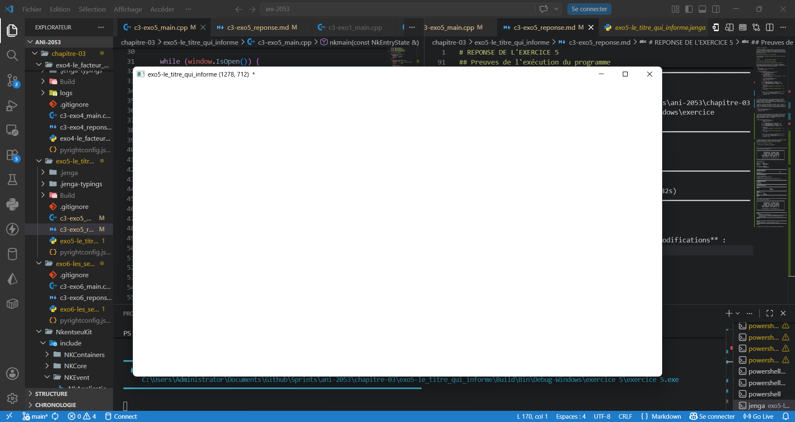

# REPONSE DE L'EXERCICE 5

>L'exercice 5 demande 3 tâches principales: Créer la fenêtre avec un titre du nom de celui du document (en l'occurence celui du dossier de l'exercice), l'ajout d'un astéris en cas de modification de la fenêtre, mais aussi la mise à jour contrôllée de la taille de la fenêtre affichée dans la barre de titre.

## Création de la fenêtre avec le titre demandé

Le titre choisi ici est celui du chapitre. Cette tâche est assurée par le bout de code:

```cpp
cfg.title       =   "exo5-le_titre_qui_informe";
```
dès le départ de la configuration de la fenêtre.

## Ajout de l'astérisque en cas de modification de la fenêtre

L'astérisque n'est pas fait au hasard. Il est géré par unevariable booléenne qui permet de détecter tous les évènements en rapport avec la fenêtre comme montré dans le bloc de code suivant:

```cpp
    math::NkVec2u size = window.GetSize();
    bool modified = false;

    while (window.IsOpen()) {
        while (NkEvent* e = NkEvents().PollEvent()) {
            if (e->Is<NkWindowCloseEvent>())
                window.Close();
            if (e->As<NkWindowMoveEvent>()) {
                modified = true;
                window.SetTitle("exo5-le_titre_qui_informe * " + window.GetSize().ToString());
            }
            if (e->Is<NkWindowResizeEndEvent>()) {
                size = window.GetSize();
                modified = true;
            }
            if (e->Is<NkWindowDpiEvent>()) modified = true;
            if (e->Is<NkWindowPaintEvent>()) modified = true;
            if (e->Is<NkWindowMoveEndEvent>()) modified = true;

            if (modified) {
                window.SetTitle("exo5-le_titre_qui_informe " + size.ToString() + "  * ");
            } else {
                window.SetTitle("exo5-le_titre_qui_informe " + size.ToString());
            }
            
            //retire l'état modifié par un enregistrementavec CTRL + S
            if (auto* key = e->As<NkKeyPressEvent>()) {
                if (key->GetKey() == NkKey::NK_S && key->HasCtrl())
                modified = false;
            }
        }
    }
```

- **La gestion contrôlée de l'état de modification de la fenêtre** : Ici, la fenêtre est considérée comme modifiée lorsqu'elle reçoit un message d'évènement de type `NKWindowEvent`. La réception de ses messages entraine la modificatoin de la variable booléenne **modified** qui défini l'ajout de l'astérisque.

- **La mise à jour de la taille dans le titre** : La mise à jour de la taille de la fenêtre dans le titre de la fenêtre se fait à chaque frames. La variable qui y est modifié est `size` de type `NKVecu`qui par contre ne se voit changé qu'en cas de redimentionnement de la fenêtre. 

```cpp
if (e->Is<NkWindowResizeEndEvent>()) {
    size = window.GetSize();
    modified = true;
}
```

- L'état de la fenêtreest questionné par la variable `modified`, qui ne s'annule que par un enregistrement fictif enclanché par un raccourci clavier. Elle ne passe à true que lorsque des modification sérieurses dont: **Le changement de DPI**; **Le changement de position**, **Le redimensionnement** ont lieu sur la fenêtre.

```cpp
if (e->Is<NkWindowResizeEndEvent>()) {
                size = window.GetSize();
                modified = true;
            }
            if (e->As<NkWindowMoveEvent>()) modified = true;
            if (e->Is<NkWindowDpiEvent>()) modified = true;
            if (e->Is<NkWindowPaintEvent>()) modified = true;
            if (e->Is<NkWindowMoveEndEvent>()) modified = true;

            if (modified) {
                window.SetTitle("exo5-le_titre_qui_informe " + size.ToString() + "  * ");
            } else {
                window.SetTitle("exo5-le_titre_qui_informe " + size.ToString());
            }

            //retire l'état modifié par un enregistrementavec CTRL + S
            if (auto* key = e->As<NkKeyPressEvent>()) {
                if (key->GetKey() == NkKey::NK_S && key->HasCtrl())
                modified = false;
            }
```

la variable size est ainsi réutilisé plus tard pour afficher en continue la taille courante dans la boucle de rendu, sans jamais avoir à questionner permanament la taille en interne de la fenêtre.

## Preuves de l'exécution du programme

- **Construction et lancement du programme** :

```
PS C:\Users\Administrator\Documents\Github\Sprints\ani-2053\chapitre-03\exo5-le_titre_qui_informe> jenga build

╔══════════════════════════════════════════════════════════════════╗
║                                                                  ║
║                ██╗███████╗███╗   ██╗ ██████╗  █████╗             ║
║                ██║██╔════╝████╗  ██║██╔════╝ ██╔══██╗            ║
║                ██║█████╗  ██╔██╗ ██║██║  ███╗███████║            ║
║           ██   ██║██╔══╝  ██║╚██╗██║██║   ██║██╔══██║            ║
║           ╚█████╔╝███████╗██║ ╚████║╚██████╔╝██║  ██║            ║
║            ╚════╝ ╚══════╝╚═╝  ╚═══╝ ╚═════╝ ╚═╝  ╚═╝            ║
║                                                                  ║
║             Multi-platform C/C++ Build System v2.8.0             ║
║                                                                  ║
╚══════════════════════════════════════════════════════════════════╝

Loading workspace...

Configuration: Debug
Target:        Windows x86_64
Toolchain:     clang-mingw

Build Order (1 projects):
  1. exercice 5 [WINDOWED_APP]


╔══════════════════════════════════════════════════════════════════════════════════════════════╗
║  Project: exercice 5                                                     Kind: WINDOWED_APP  ║
╚══════════════════════════════════════════════════════════════════════════════════════════════╝

ℹ Found 1 source file(s)
✓   [1/1] Compiled: c3-exo5_main.cpp
ℹ Linking...
✓ Built: Build\Bin\Debug-Windows\exercice 5\exercice 5.exe

┌──────────────────────────────────────────────────────────────────────────────────────────────┐
│  ✓ Build Successful                                                             Time: 2.41s  │
└──────────────────────────────────────────────────────────────────────────────────────────────┘

════════════════════════════════════════════════════════════════════════════════
                                BUILD COMPLETED                                 
════════════════════════════════════════════════════════════════════════════════
Projects Built:  1/1
Time:           2.41s
Status:         ✓ SUCCESS
════════════════════════════════════════════════════════════════════════════════

PS C:\Users\Administrator\Documents\Github\Sprints\ani-2053\chapitre-03\exo5-le_titre_qui_informe> jenga run

╔══════════════════════════════════════════════════════════════════╗
║                                                                  ║
║                ██╗███████╗███╗   ██╗ ██████╗  █████╗             ║
║                ██║██╔════╝████╗  ██║██╔════╝ ██╔══██╗            ║
║                ██║█████╗  ██╔██╗ ██║██║  ███╗███████║            ║
║           ██   ██║██╔══╝  ██║╚██╗██║██║   ██║██╔══██║            ║
║           ╚█████╔╝███████╗██║ ╚████║╚██████╔╝██║  ██║            ║
║            ╚════╝ ╚══════╝╚═╝  ╚═══╝ ╚═════╝ ╚═╝  ╚═╝            ║
║                                                                  ║
║             Multi-platform C/C++ Build System v2.8.0             ║
║                                                                  ║
╚══════════════════════════════════════════════════════════════════╝


━━━━━━━━━━━━━━━━━━━━━━━━━━━━━━━━━━━━━━━━━━━━━━━━━━━━━━━━━━━━━━━━━━━━━━━━━━━━━━━━
  ▶  EXECUTION  —  exercice 5.exe
     C:\Users\Administrator\Documents\Github\Sprints\ani-2053\chapitre-03\exo5-le_titre_qui_informe\Build\Bin\Debug-Windows\exercice 5\exercice 5.exe
━━━━━━━━━━━━━━━━━━━━━━━━━━━━━━━━━━━━━━━━━━━━━━━━━━━━━━━━━━━━━━━━━━━━━━━━━━━━━━━━


━━━━━━━━━━━━━━━━━━━━━━━━━━━━━━━━━━━━━━━━━━━━━━━━━━━━━━━━━━━━━━━━━━━━━━━━━━━━━━━━
  ◀  FIN D'EXECUTION  —  termine normalement  (31.82s)
━━━━━━━━━━━━━━━━━━━━━━━━━━━━━━━━━━━━━━━━━━━━━━━━━━━━━━━━━━━━━━━━━━━━━━━━━━━━━━━━
```

>Toutes les captures son consultables dans le dossier `preuve`  de l'exercice 5

- **Capture de l'état initial de la fenêtre avant modifications** : L'astérisque est visible ici car la fenêtre subit un redimensionnement par défaut lors de sa création.


- **Capture de l'état de la fenêtre Après un CTRL + s** : On peut remarquer sur l'image que l'astérisque a disparu . Cette disparition de l'astérisque est dû au bloc de code suivants:


```cpp
//retire l'état modifié par un enregistrementavec CTRL + S
            if (auto* key = e->As<NkKeyPressEvent>()) {
                if (key->GetKey() == NkKey::NK_S && key->HasCtrl())
                modified = false;
            }
```
Il utilise le modificateur CTRL Et associé à la touche S Afin de faire passer à Faux la valeur booléenne de modified.