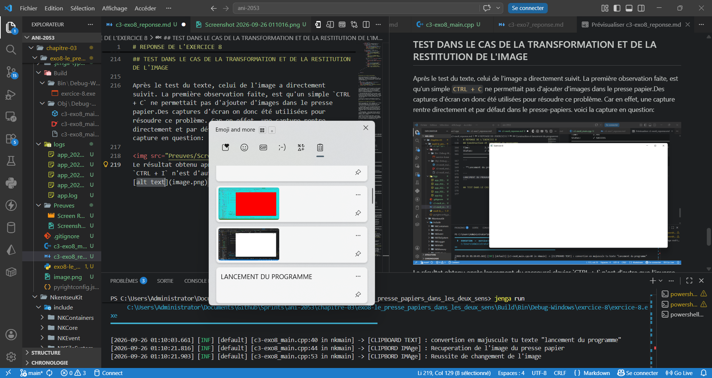

# REPONSE DE L'EXERCICE 8

> L'exercice nous demande d'écrire un programme qui lit le texte dans le presse papiers, le met en majuscules et le remet. Puis de fiare la même chose avec une image pour laquelle après lecture, on inversera les couleurs avant de la remettre. Le code est ici écrit en un seul fichier, celui demandé par l'exercice.

## Etat du fichier source de l'exercice

Le fichier source de l'exercice ne présente qu'un code minimal d'affichage de fenêtre, intégrant des réactions spécifiques à deux types d'évènements : L'évènement de fenêtre et celui de clavier.

```cpp
#include "NKWindow/NKMain.h"
#include "NKWindow/NKWindow.h"
#include "NKEvent/NkEventSystem.h"
#include "NKEvent/NkWindowEvent.h"
#include "NKEvent/NkKeyboardEvent.h"

using namespace nkentseu;

NKENTSEU_DEFINE_APP_DATA(([] () {
    NkAppData d {};
    d.appName       =   "Exercice8";
    d.appVersion    =   "0.1.0";
    return d;
})())

int nkmain(const NkEntryState& state) {
    NkWindowConfig cfg;
    cfg.title       =   "Exercice 8";
    cfg.width       =   1280;
    cfg.height      =   720;

    NkWindow window(cfg);
    if (!window.IsOpen()) {
        logger.Info("[FENETRE] : Erreur d'initialisation de la fenêtre !");
        return -1;
    }

    //variable de stockage des tests
    NkString text;
    NkClipboardImage image {};

    while (window.IsOpen()) {
        while (NkEvent* e = NkEvents().PollEvent()) {
            if (e->Is<NkWindowCloseEvent>())
                window.Close();
            if (auto* key = e->As<NkKeyPressEvent>()) {
                if (key->GetKey() == NkKey::NK_G && key->HasCtrl()) {
                    text = window.GetClipboardText();
                    window.SetClipboardText(text.ToUpper());
                    logger.Info("[CLIPBOARD TEXT] : convertion en majuscule tu texte \"{0}\"", text.ToLower());
                }
                if (key->GetKey() == NkKey::NK_I && key->HasCtrl()) {
                    if (window.GetClipboardImage(image)) {
                        logger.Info("[CLIPBORD IMAge] : Récupération de l'image du presse papier");
                    } else {
                        logger.Error("[CLIPBORD IMAge] : Impossible de recupérer l'image du presse papier");
                    }
                    for (int i = 0; i < image.pixels.size(); i++) {
                        if (i % 4 == 0) continue;
                        image.pixels[i] = 255u - image.pixels[i];
                    }
                    if (window.SetClipboardImage(image)) {
                        logger.Info("[CLIPBORD IMAge] : Reussite de changement de l'image");
                    } else {
                        logger.Error("[CLIPBORD IMAge] : Echec , image invalide par l'OS");
                    }
                }
            }
        }
    }
    

    return 0;
}
```

## Opérations sur le texte du presse-papiers

D'après les fichiers entêtes et source que sont resoectivement `Nkwindow.h` et `NkWin32Window.cpp`, les méthodes liées à cet exercice ont été identifiée comme étant `GetClipboardText()`, et `SetClipboardText`, utilisées selon le bloc de code suivant:

```cpp
if (key->GetKey() == NkKey::NK_G && key->HasCtrl()) {
    text = window.GetClipboardText();
    window.SetClipboardText(text.ToUpper());
    logger.Info("[CLIPBOARD TEXT] : convertion en majuscule tu texte \"{0}\"", text.ToLower());
}
```

- `GetClipboardText()` permet de récupérer le texte contenu dans le presse-papier, et de le stocker dans une variable temporaire de type NKString (`text`) qui sera manipulée plus tard (Ce choix a été opéré par souci de visibilité. Utiliser la méthode directement dans la SetClipboardImage() aurait été une approche envisageable).

- `SetClipboardText(NKString& out)`: Cette méthode là permet de placer du texte dans le presse-papier. Dans cet exercice, elle est utilisé pour remplacer le text copié par sa version en majuscule au travers la méthode `ToUpper` propre à l'objet `text` de type NkString. Le texte ainsi remplacé peut être facilement copié.

Le contrôle de l'opération de transformation du texte du presse -papier est effectué par le raccourci clavier `CTRL + G`.

## Opération sur les images du presse-papier

Toujours en se basant sur l'entête `Nkwindow.h` et le fichier source `NkWin32Window.cpp`, on a pu identifier que l'opération de recupération et de restitution de l'image était assurer par deux méthodes distinctes, que sont : 

- `GetClipboardImage` : C'est une méthode booléenne propre aux objets de type `NkWindow` qui permet de recupérer une image dans le presse papier. Elle est utilisée ici pour stocker les pixels de l'image dans une variable nommée dans le programme `image` pour une modification ultérieure des pixels.

- `SetClipboardImage` : Cette méthode booléenne, permet de placer une image dans le presse papier. Elle sert dans ce progrmma à placer l'image modifiée, inversant les couleurs des pixels qui s'y trouvent.

L'algorithme d'inversion de couleur quant à lui est très simple. Il par sur la base que pour des couleurs en RGBA8, trouver l'inverse revient à assigner pour chaque composantes R, G et B d'un pixel, la valeur obtenue par la soustraction de la valeur courante de la composante de 255. Soit :

```
R = 255 - R
G = 255 - G
B = 255 = B
A = A
```
ce qui se traduit par le bloc ci dessous :
```cpp
for (int i = 0; i < image.pixels.size(); i++) {
    if (i % 4 == 0) continue;
    image.pixels[i] = 255u - image.pixel [i];
}
```

## Construction et lancement du programme

- **Construction** :
```
PS C:\Users\Administrator\Documents\Github\Sprints\ani-2053\chapitre-03\exo8-le_presse_papiers_dans_les_deux_sens> jenga build

╔══════════════════════════════════════════════════════════════════╗
║                                                                  ║
║                ██╗███████╗███╗   ██╗ ██████╗  █████╗             ║
║                ██║██╔════╝████╗  ██║██╔════╝ ██╔══██╗            ║
║                ██║█████╗  ██╔██╗ ██║██║  ███╗███████║            ║
║           ██   ██║██╔══╝  ██║╚██╗██║██║   ██║██╔══██║            ║
║           ╚█████╔╝███████╗██║ ╚████║╚██████╔╝██║  ██║            ║
║            ╚════╝ ╚══════╝╚═╝  ╚═══╝ ╚═════╝ ╚═╝  ╚═╝            ║
║                                                                  ║
║             Multi-platform C/C++ Build System v2.8.0             ║
║                                                                  ║
╚══════════════════════════════════════════════════════════════════╝

Loading workspace...

Configuration: Debug
Target:        Windows x86_64
Toolchain:     clang-mingw

Build Order (1 projects):
  1. exrcice-8 [CONSOLE_APP]


╔══════════════════════════════════════════════════════════════════════════════════════════════╗
║  Project: exrcice-8                                                       Kind: CONSOLE_APP  ║
╚══════════════════════════════════════════════════════════════════════════════════════════════╝

ℹ Found 1 source file(s)
✓   [1/1] Compiled: c3-exo8_main.cpp
ℹ Linking...
✓ Built: Build\Bin\Debug-Windows\exrcice-8\exrcice-8.exe

┌──────────────────────────────────────────────────────────────────────────────────────────────┐
│  ✓ Build Successful                                                             Time: 2.76s  │
└──────────────────────────────────────────────────────────────────────────────────────────────┘

════════════════════════════════════════════════════════════════════════════════
                                BUILD COMPLETED                                 
════════════════════════════════════════════════════════════════════════════════
Projects Built:  1/1
Time:           2.76s
Status:         ✓ SUCCESS
════════════════════════════════════════════════════════════════════════════════
```

- **Lancement du programme** :

```
PS C:\Users\Administrator\Documents\Github\Sprints\ani-2053\chapitre-03\exo8-le_presse_papiers_dans_les_deux_sens> jenga run

╔══════════════════════════════════════════════════════════════════╗
║                                                                  ║
║                ██╗███████╗███╗   ██╗ ██████╗  █████╗             ║
║                ██║██╔════╝████╗  ██║██╔════╝ ██╔══██╗            ║
║                ██║█████╗  ██╔██╗ ██║██║  ███╗███████║            ║
║           ██   ██║██╔══╝  ██║╚██╗██║██║   ██║██╔══██║            ║
║           ╚█████╔╝███████╗██║ ╚████║╚██████╔╝██║  ██║            ║
║            ╚════╝ ╚══════╝╚═╝  ╚═══╝ ╚═════╝ ╚═╝  ╚═╝            ║
║                                                                  ║
║             Multi-platform C/C++ Build System v2.8.0             ║
║                                                                  ║
╚══════════════════════════════════════════════════════════════════╝


━━━━━━━━━━━━━━━━━━━━━━━━━━━━━━━━━━━━━━━━━━━━━━━━━━━━━━━━━━━━━━━━━━━━━━━━━━━━━━━━
  ▶  EXECUTION  —  exrcice-8.exe
     C:\Users\Administrator\Documents\Github\Sprints\ani-2053\chapitre-03\exo8-le_presse_papiers_dans_les_deux_sens\Build\Bin\Debug-Windows\exrcice-8\exrcice-8.exe
━━━━━━━━━━━━━━━━━━━━━━━━━━━━━━━━━━━━━━━━━━━━━━━━━━━━━━━━━━━━━━━━━━━━━━━━━━━━━━━━

[2026-09-26 01:10:03.661] [INF] [default] [c3-exo8_main.cpp:40 in nkmain] -> [CLIPBOARD TEXT] : convertion en majuscule tu texte "lancement du programme"
[2026-09-26 01:10:21.816] [INF] [default] [c3-exo8_main.cpp:44 in nkmain] -> [CLIPBORD IMAge] : Recuperation de l'image du presse papier
[2026-09-26 01:10:21.903] [INF] [default] [c3-exo8_main.cpp:53 in nkmain] -> [CLIPBORD IMAge] : Reussite de changement de l'image

━━━━━━━━━━━━━━━━━━━━━━━━━━━━━━━━━━━━━━━━━━━━━━━━━━━━━━━━━━━━━━━━━━━━━━━━━━━━━━━━
  ◀  FIN D'EXECUTION  —  termine normalement  (114.24s)
━━━━━━━━━━━━━━━━━━━━━━━━━━━━━━━━━━━━━━━━━━━━━━━━━━━━━━━━━━━━━━━━━━━━━━━━━━━━━━━━
```

## TEST DANS LE CAS DE LA TRANSFORMATION DU TEXTE

Lors du lancement de l'exécutable, la chaine ce caractère copiée dans le presse-papiers à l'aide de `CTRL + C` a été **Lancement du programme** . l'utilisation du raccourci `CTRL + G` a amené à l'obtension de la sa version en majuscule: **LANCEMENT DU PROGRAMME**. Tel que montré dans la vidéo.
<video src="Preuves/Screen Recording 2026-09-26 011041.mp4">

- sorties de log produites pour le texte .

```
[2026-09-26 01:10:03.661] [INF] [default] [c3-exo8_main.cpp:40 in nkmain] -> [CLIPBOARD TEXT] : convertion en majuscule tu texte "lancement du programme"
```
Comme indiqué plus haut, la sortie de logger ne ment pas. la phrase convertie étant donc "lancement du programme".

## TEST DANS LE CAS DE LA TRANSFORMATION ET DE LA RESTITUTION DE L'IMAGE

Après le test du texte, celui de l'image a directement suivit. La première observation faite, est qu'un simple `CTRL + C` ne permettait pas d'ajouter d'images dans le presse papier.Des captures d'écran on donc été utilisées pour résoudre ce problème. Car en effet, une capture rentre directement et par défaut dans le presse-papiers. voici la capture en question:


Le résultat obtenu après lancement du raccourci  clavier `CTRL + I` n'est d'autre que l'inverse de cette image. Soit l'image du haut en rouge bleu du presse-papier au milieu de l'écran :




Le résultat du texte et de l'image peuvent être directement consultés sur la vidéo fournie en annexe dans le dossier `Preuves`.