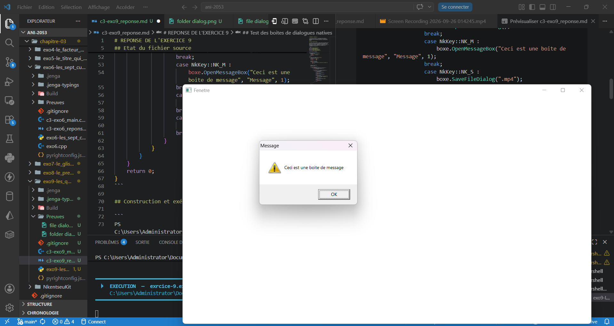

# REPONSE DE L'EXERCICE 9

> L'exercice 9 consite en l'utilisation des boites de dialogue natives et en la vérification de l'intégrité du programme en cas d'annulation directe de l'action quelles suggère.

## Etat du fichier source

Le fichier source présente le code minimal d'affichage d'une fenêtre avec une gestion personnalisée de quelques touches physiques du clavier. La classe mise en avant dans cet exercice est la classe `NkDialogs`, qui permet au travers de 4 méthodes de créer les fenêtres de dialogue pour la validation de l'exercice 9.

```cpp
#include "NKWindow/NKWindow.h"
#include "NKWindow/NKMain.h"
#include "NKEvent/NkEventSystem.h"
#include "NKEvent/NkWindowEvent.h"
#include "NKEvent/NkKeyboardEvent.h"

using namespace nkentseu;

NKENTSEU_DEFINE_APP_DATA(([]() {
    NkAppData d{};
    d.appName    = "exercice 1";
    d.appVersion = "0.1.0";
    return d;
})());

int nkmain(const NkEntryState& state) {
    NkWindowConfig cfg;
    cfg.title   =   "Fenetre";
    cfg.width   =   1280;
    cfg.height  =   720;

    NkWindow window(cfg);
    if (!window.IsOpen()) {
        logger.Error("Erreur de création de la fenêtre.");
        return -1;
    }

    //boite de dialiogue
    NkDialogs boxe;

    while (window.IsOpen()) {
        while (NkEvent* e = NkEvents().PollEvent()) {
            if (e->Is<NkWindowCloseEvent>()) {
                window.Close();
            }
            if (auto* key = e->As<NkKeyPressEvent>()) {
                switch (key->GetKey()) {
                    case NkKey::NK_F :
                        boxe.OpenFileDialog();
                    break;
                    case NkKey::NK_D :
                        boxe.OpenFolderDialog();
                    break;
                    case NkKey::NK_M :
                        boxe.OpenMessageBox("Ceci est une boite de message", "Message", 1);
                    break;
                    case NkKey::NK_S :
                        boxe.SaveFileDialog(".mp4");
                    break;
                    case NkKey::NK_L :
                        window.Close();
                    break;
                }
            }
        }
    }
    return 0;
}
```

## Construction et exécution du programme

```
PS C:\Users\Administrator\Documents\Github\Sprints\ani-2053\chapitre-03\exo9-les_quatre_dialogues> jenga build

╔══════════════════════════════════════════════════════════════════╗
║                                                                  ║
║                ██╗███████╗███╗   ██╗ ██████╗  █████╗             ║
║                ██║██╔════╝████╗  ██║██╔════╝ ██╔══██╗            ║
║                ██║█████╗  ██╔██╗ ██║██║  ███╗███████║            ║
║           ██   ██║██╔══╝  ██║╚██╗██║██║   ██║██╔══██║            ║
║           ╚█████╔╝███████╗██║ ╚████║╚██████╔╝██║  ██║            ║
║            ╚════╝ ╚══════╝╚═╝  ╚═══╝ ╚═════╝ ╚═╝  ╚═╝            ║
║                                                                  ║
║             Multi-platform C/C++ Build System v2.8.0             ║
║                                                                  ║
╚══════════════════════════════════════════════════════════════════╝

Loading workspace...

Configuration: Debug
Target:        Windows x86_64
Toolchain:     clang-mingw

Build Order (1 projects):
  1. exrcice-9 [CONSOLE_APP]


╔══════════════════════════════════════════════════════════════════════════════════════════════╗
║  Project: exrcice-9                                                       Kind: CONSOLE_APP  ║
╚══════════════════════════════════════════════════════════════════════════════════════════════╝

ℹ Found 1 source file(s)
✓   [1/1] Compiled with warnings: c3-exo9_main.cpp
╔══════════════════════════════════════════════════════════════════════════════════════════════╗
║                                  Warning: c3-exo9_main.cpp                                   ║
╠══════════════════════════════════════════════════════════════════════════════════════════════╣
║ C:\Users\Administrator\Documents\Github\Sprints\ani-2053\chapitre-03\exo9-les_quatre_dialogu ║
║ es\c3-exo9_main.cpp:37:30: warning: 167 enumeration values not handled in switch:            ║
║ 'NK_UNKNOWN', 'NK_ESCAPE', 'NK_F1'... [-Wswitch]                                             ║
║    37 |                 switch (key->GetKey()) {                                             ║
║       |                         ~~~~~^~~~~~~~                                                ║
║ 1 warning generated.                                                                         ║
╚══════════════════════════════════════════════════════════════════════════════════════════════╝
ℹ Linking...
✓ Built: Build\Bin\Debug-Windows\exrcice-9\exrcice-9.exe

┌──────────────────────────────────────────────────────────────────────────────────────────────┐
│  ✓ Build Successful                                                             Time: 2.62s  │
│ Warnings: 2                                                                                  │
└──────────────────────────────────────────────────────────────────────────────────────────────┘

════════════════════════════════════════════════════════════════════════════════
                                BUILD COMPLETED                                 
════════════════════════════════════════════════════════════════════════════════
Projects Built:  1/1
Warnings:       2
Time:           2.62s
Status:         ✓ SUCCESS
════════════════════════════════════════════════════════════════════════════════

PS C:\Users\Administrator\Documents\Github\Sprints\ani-2053\chapitre-03\exo9-les_quatre_dialogues> jenga run

╔══════════════════════════════════════════════════════════════════╗
║                                                                  ║
║                ██╗███████╗███╗   ██╗ ██████╗  █████╗             ║
║                ██║██╔════╝████╗  ██║██╔════╝ ██╔══██╗            ║
║                ██║█████╗  ██╔██╗ ██║██║  ███╗███████║            ║
║           ██   ██║██╔══╝  ██║╚██╗██║██║   ██║██╔══██║            ║
║           ╚█████╔╝███████╗██║ ╚████║╚██████╔╝██║  ██║            ║
║            ╚════╝ ╚══════╝╚═╝  ╚═══╝ ╚═════╝ ╚═╝  ╚═╝            ║
║                                                                  ║
║             Multi-platform C/C++ Build System v2.8.0             ║
║                                                                  ║
╚══════════════════════════════════════════════════════════════════╝


━━━━━━━━━━━━━━━━━━━━━━━━━━━━━━━━━━━━━━━━━━━━━━━━━━━━━━━━━━━━━━━━━━━━━━━━━━━━━━━━
  ▶  EXECUTION  —  exrcice-9.exe
     C:\Users\Administrator\Documents\Github\Sprints\ani-2053\chapitre-03\exo9-les_quatre_dialogues\Build\Bin\Debug-Windows\exrcice-9\exrcice-9.exe
━━━━━━━━━━━━━━━━━━━━━━━━━━━━━━━━━━━━━━━━━━━━━━━━━━━━━━━━━━━━━━━━━━━━━━━━━━━━━━━━


━━━━━━━━━━━━━━━━━━━━━━━━━━━━━━━━━━━━━━━━━━━━━━━━━━━━━━━━━━━━━━━━━━━━━━━━━━━━━━━━
  ◀  FIN D'EXECUTION  —  termine normalement  (82.82s)
━━━━━━━━━━━━━━━━━━━━━━━━━━━━━━━━━━━━━━━━━━━━━━━━━━━━━━━━━━━━━━━━━━━━━━━━━━━━━━━━
```

La constructione le lancement de l'exécutable se passent sans encombre, ce qui constitue le premier gage de réussite des tests à venir

## Test des boites de dialogues natives

- **File Dialog** : C'est la boite de recherche de fichiers. Elle est crée par la méthode `OpenFileDialog()` et permet de trouver un fichier depuis l'explorateur et normalement de l'ouvrir. Elle permet de parcourir tout le disque, partitions incluses. Dans sa configuration actuelle, aucun fichiers l'apparait dans la fenêtre de l'explorateur qui s'ouvre. Cliquer sur le bouton `Cancel` plus bas n'entraine pas une terminaison du programme. (l'exécution du programme est faite en continue tout le long de la rédaction de la réponse à partir de ce paragraphe).


- **Folder Dialog** : Elle perlet l'ouverture d'un dossier, ou plutôt dans le cas échéant de le sélectionner. Car une fois cliqué sur `ok` ou sur `Cancel`, la fenêtre de dialogue se refferme directement en laissant le programme se poursuivre proprement. Elle est crée par la méthode `OpenFolderDialog()` de l'objet `boxe`. Tout comme la File Dialog, elle permet de parcourir tout l'espace du disque et de choisir le dossier que l'on veut ouvir.


- **La boite de messages** : Elle est crée dans le programme en appyant sur la touche `M` du clavier. Elle est crée grâce à la méthode `OpenMessageBox()`. Elle mermet d'afficher une fenêtre contenant un titre et un contenu qui est une chaine de caractère contituant un message à destination de l'utilisateur. Là encore, sa fermeture n'entraine aucun arrêt du programme prnicipal. seule la fenêtre de dialogue se ferme après avoir cliqué sur le bouton `Ok`.



- **Boite de sauvegarde** : La boite de sauvegarde est créée dans le programme en appuyant sur la touche `S`. Elle permet de sauvegarder un fichier sur le disque. Ici il n'y a rien à sauvegader. Elle est créée grâce à la méthode `SaveFileDialog` de la variable `boxe`. ici toujours, la fermeture n'a aucun effet.


## Conclusion quand la fermeture des boites de dialogue

L'exercice demande à vérifier qu'aucune annulation de boite de dialogue ne fait planter le programme. La réponse est non. Toutes les boites de dialogues réagissent normalement à l'annulation ou la fermeture même si rien n'a été choisi. La preuve étant que, les paragraphes ont été écrit en faisant des tests en direct sur le programme. (le programme tournait depuis le premier paragraphe de teste des boites de dialogues, sans interruptions ni anomalies). Il a ainsi totalisé un temps de **4175.69s** selon Jenga avec un code de fin normal. comme l'indique la dernière sortie suivante :

```
PS C:\Users\Administrator\Documents\Github\Sprints\ani-2053\chapitre-03\exo9-les_quatre_dialogues> jenga run

╔══════════════════════════════════════════════════════════════════╗
║                                                                  ║
║                ██╗███████╗███╗   ██╗ ██████╗  █████╗             ║
║                ██║██╔════╝████╗  ██║██╔════╝ ██╔══██╗            ║
║                ██║█████╗  ██╔██╗ ██║██║  ███╗███████║            ║
║           ██   ██║██╔══╝  ██║╚██╗██║██║   ██║██╔══██║            ║
║           ╚█████╔╝███████╗██║ ╚████║╚██████╔╝██║  ██║            ║
║            ╚════╝ ╚══════╝╚═╝  ╚═══╝ ╚═════╝ ╚═╝  ╚═╝            ║
║                                                                  ║
║             Multi-platform C/C++ Build System v2.8.0             ║
║                                                                  ║
╚══════════════════════════════════════════════════════════════════╝


━━━━━━━━━━━━━━━━━━━━━━━━━━━━━━━━━━━━━━━━━━━━━━━━━━━━━━━━━━━━━━━━━━━━━━━━━━━━━━━━
  ▶  EXECUTION  —  exrcice-9.exe
     C:\Users\Administrator\Documents\Github\Sprints\ani-2053\chapitre-03\exo9-les_quatre_dialogues\Build\Bin\Debug-Windows\exrcice-9\exrcice-9.exe
━━━━━━━━━━━━━━━━━━━━━━━━━━━━━━━━━━━━━━━━━━━━━━━━━━━━━━━━━━━━━━━━━━━━━━━━━━━━━━━━


━━━━━━━━━━━━━━━━━━━━━━━━━━━━━━━━━━━━━━━━━━━━━━━━━━━━━━━━━━━━━━━━━━━━━━━━━━━━━━━━
  ◀  FIN D'EXECUTION  —  termine normalement  (4175.69s)
━━━━━━━━━━━━━━━━━━━━━━━━━━━━━━━━━━━━━━━━━━━━━━━━━━━━━━━━━━━━━━━━━━━━━━━━━━━━━━━━
```